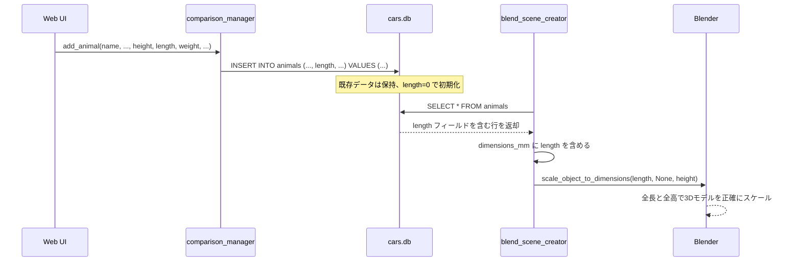

# 動物全長データ追加仕様書

## 1. 概要

動物比較動画パイプラインに「全長（length）」データを追加し、3Dモデルの配置・スケールを全高＋全長の2軸で正確に制御できるようにする。

- **目的**: 动物のGLBモデルを実寸に近いスケールでBlenderシーンに配置
- **対象**: 动物システムのみ（cars_configは変更しない）
- **制約**: 既存DBデータの消去・破壊的変更は禁止

---

## 2. 現在の状態

| 箇所 | ファイル | 線番号 | 現状 |
|------|---------|--------|------|
| DBテーブル定義 | [`comparison_manager.py:641`](comparison_manager.py:641) | height, weight のみ |
| 動物追加 | [`comparison_manager.py:964`](comparison_manager.py:964) | height, weight をINSERT |
| 動物更新 | [`comparison_manager.py:998`](comparison_manager.py:998) | height, weight をUPDATE |
| DB読み込み | [`blend_scene_creator.py:101`](blend_scene_creator.py:101) | height, weight のみ取得 |
| 設定マージ | [`blend_scene_creator.py:146`](blend_scene_creator.py:146) | dimensions_mmにheight,weightのみ |
| スケール適用 | [`blend_scene_creator.py:893`](blend_scene_creator.py:893) | heightのみをスケールに渡す |
| Web UI 一覧 | [`pages/01_動物一覧.py:95`](pages/01_動物一覧.py:95) | 全高・体重のみ表示 |
| Web UI フォーム | [`pages/01_動物一覧.py:133`](pages/01_動物一覧.py:133) | 全高・体重の入力欄のみ |

---

## 3. 変更内容

### 3.1 DBスキーマ変更 (`comparison_manager.py`)

**対象関数**: [`init_animals_table()`](comparison_manager.py:641)

ALTER TABLE で `length` カラムを追加（既存データ保護対応）:

```python
# 追加するマイグレーションブロック
try:
    conn.execute("ALTER TABLE animals ADD COLUMN length REAL DEFAULT 0")
except sqlite3.OperationalError:
    pass  # 既に存在する場合は無視
```

**影響**: 既存行は `length=0` で初期化。他のカラムデータはそのまま保持。

---

### 3.2 CRUD関数修正 (`comparison_manager.py`)

#### [`add_animal()`](comparison_manager.py:964)
- **変更前シグネチャ**: `add_animal(name, glb_filename, animal_type, height, weight, rotation, color_name)`
- **変更後シグネチャ**: `add_animal(name, glb_filename, animal_type, height, length, weight, rotation, color_name)`
- INSERT文に `length` カラムを追加

#### [`update_animal()`](comparison_manager.py:998)
- **変更前シグネチャ**: `update_animal(animal_id, name, glb_filename, animal_type, height, weight, rotation, color_name)`
- **変更後シグネチャ**: `update_animal(animal_id, name, glb_filename, animal_type, height, length, weight, rotation, color_name)`
- UPDATE文に `length = ?` を追加

---

### 3.3 DB読み込み修正 (`blend_scene_creator.py`)

#### [`load_animals_db()`](blend_scene_creator.py:101)
```python
animals_db[animal_id] = {
    "name": row["name"],
    "glb_filename": row["glb_filename"],
    "animal_type": row["animal_type"],
    "height": row["height"],
    "length": row["length"],       # ← 追加
    "weight": row["weight"],
    "rotation_direction": row["rotation_direction"],
    "color_name": row["color_name"]
}
```

#### [`load_animals_config()`](blend_scene_creator.py:146)
```python
merged[dst_key] = {
    # ... 既存フィールド ...
    "dimensions_mm": {
        "length": db_data["length"],   # ← 追加
        "height": db_data["height"],
        "weight": db_data["weight"],
    },
    # ...
}
```

---

### 3.4 スケール適用修正 (`blend_scene_creator.py`)

#### [`setup_car()`](blend_scene_creator.py:893)

現在の逻辑では动物の場合、`dimensions_mm` に `length` が存在しないため height のみでスケールされる。

`length` フィールドが追加され、0 以外の値が設定されている場合は、`scale_object_to_dimensions()` に length も渡すように変更する:

```python
# サイズ指定がある場合はスケール適用
if 'dimensions_mm' in car_data:
    dims = car_data['dimensions_mm']
    has_length = 'length' in dims
    has_width = 'width' in dims
    length_val = dims.get('length', None) if has_length else None
    width_val = dims.get('width', None) if has_width else None
    height_val = dims.get('height', 1620)
    
    # 动物の場合、length が 0 の場合はスケーリングをスキップ（未入力扱い）
    if length_val is not None and length_val == 0:
        length_val = None
    
    scale_object_to_dimensions(
        imported_object,
        length_val,
        width_val,
        height_val
    )
```

---

### 3.5 Web UI修正 (`pages/01_動物一覧.py`)

#### 一覧表示（L95）
- `expected_cols` に `"length"` を追加
- 列名マップに `"length": "全長(mm)"` を追加

#### 新規追加フォーム（L145）
```python
with col_dims_a:
    inp_height = st.number_input("全高 (mm)", ...)
    inp_length = st.number_input("全長 (mm)", ...)  # ← 追加
    inp_weight = st.number_input("体重 (kg)", ...)
```

#### 編集フォーム（L133）
- `edit_animal_data.get("length", 0)` から値を読み取る入力欄を追加

#### CRUD呼び出し（L187, L199）
- `add_animal()` / `update_animal()` の引数に `inp_length` を追加

#### 詳細表示（L223）
- 全長を表示項目に追加

---

## 4. データフロー図



---

## 5. 影響を受けるファイル一覧

| ファイル | 変更内容 |
|---------|---------|
| [`comparison_manager.py`](comparison_manager.py) | DBスキーマ追加, CRUD関数修正 |
| [`blend_scene_creator.py`](blend_scene_creator.py) | DB読み込み修正, スケール適用修正 |
| [`pages/01_動物一覧.py`](pages/01_動物一覧.py) | 全長入力欄・表示追加 |

---

## 6. テスト項目

1. DBマイグレーション実行 → `length` カラムが追加されるか確認
2. Web UIで新規动物を追加（全長を含む）→ DBに登録されるか確認
3. 既存動物の編集で全長を更新 → DBに反映されるか確認
4. Blenderスクリプト実行 → 全長と全高でスケールが適用されるか確認
5. 既存データの全高・体重値が変更されていないか確認

---

## 7. 注意点

- ALTER TABLE は一度だけ実行され、2回目以降は sqlite3.OperationalError で無視される
- length=0 の場合は「未入力」とみなし、その軸のスケールをスキップする
- cars_config.json や车関連のコードは一切変更しない（プロジェクトルール遵守）
- 既存の animals テーブルデータは完全に保持される
