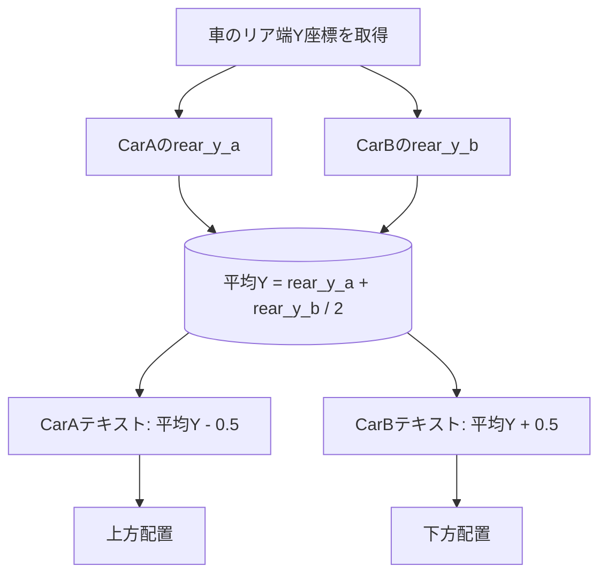

# 車名テキストラベルのY軸上下配置修正計画

## 問題の説明
カット1〜カット5で共通の問題として、車の長さが同じ（または近い）場合、CarAとCarBの車名テキストラベルがY軸方向で同じ位置に配置され、文字がかぶってしまう。

## 現在の動作
[`create_glowing_text_label()`](blend_scene_creator.py:860) 関数では、各車のリア端（`world_min_y`）から個別にYオフセットを計算している：

```python
# 現在の実装 (901行目付近)
y_margin_world = world_car_length_y * 0.15 + 0.3
text_y_world = world_min_y - y_margin_world
```

車の長さが同じ場合、`world_min_y` もほぼ同じ値になり、テキストのY位置がかぶってしまう。

## 修正方針
両車のリア端の**平均Y座標**を基準点とし、CarAは上方（Y負方向）、CarBは下方（Y正方向）に固定オフセットで配置する。

### 修正対象ファイル
1. **`blend_scene_creator.py`** - `create_glowing_text_label()` 関数と main() 内の呼び出し箇所

## 具体的な修正内容

### 1. `create_glowing_text_label()` 関数の修正 (860行目〜)

**変更前:**
```python
def create_glowing_text_label(car_key, car_object, text_content, color_rgb):
```

**変更後:**
```python
def create_glowing_text_label(car_key, car_object, text_content, color_rgb, shared_rear_y=None):
    """車の足元に発光する3Dテキストラベルを作成し、車にペアレント設定
    
    【修正】shared_rear_y が指定された場合、両車のリア端の平均Y座標を基準に
    CarAは上方（Y負方向）、CarBは下方（Y正方向）に固定オフセットで配置する。
    
    Parameters:
        car_key: "carA" または "carB"
        car_object: 車オブジェクト
        text_content: テキスト文字列
        color_rgb: テキストの色 (R, G, B)
        shared_rear_y: 両車のリア端の平均Y座標（指定された場合、上下配置モードになる）
    """
```

### 2. Y位置計算ロジックの変更 (901行目付近)

**変更前:**
```python
# Y位置: リア端から後ろに配置（ワールド座標）
text_y_world = world_min_y - y_margin_world
```

**変更後:**
```python
if shared_rear_y is not None:
    # 【修正】上下配置モード: 両車のリア端平均Yを基準に、CarAは上方、CarBは下方に配置
    y_margin_base = 0.5  # 中央からの固定オフセット距離
    if car_key == "carA":
        text_y_world = shared_rear_y - y_margin_base  # CarAは上方（Y負方向=画面の上側）
    else:
        text_y_world = shared_rear_y + y_margin_base  # CarBは下方（Y正方向=画面の下側）
    print(f"  【上下配置モード】shared_rear_y={shared_rear_y:.3f}, car_key={car_key} -> text_y={text_y_world:.3f}")
else:
    # 従来モード: 各車のリア端から個別に計算
    y_margin_world = world_car_length_y * 0.15 + 0.3
    text_y_world = world_min_y - y_margin_world
```

### 3. `main()` 関数の呼び出し箇所修正 (1169行目付近)

**変更前:**
```python
for key, car_data in CARS.items():
    car_obj = imported_cars.get(key)
    if not car_obj:
        continue
    
    # JSONから車種名と色を取得
    text_content = car_data["name"]
    color_rgb = car_data["color"]
    
    # 発光テキストを作成（ペアレント設定含む）
    if CUT_NUMBER == "short2":
        create_glowing_text_label_short2(key, car_obj, text_content, color_rgb)
    else:
        create_glowing_text_label(key, car_obj, text_content, color_rgb)
```

**変更後:**
```python
# 両車のリア端Y座標を計算し、平均値を取得（上下配置用）
def get_rear_end_y(car_obj):
    """バウンディングボックスから後端（Y最小）のワールド座標を取得"""
    bounds = [Vector(b) for b in car_obj.bound_box]
    corners_world = [car_obj.matrix_world @ corner for corner in bounds]
    return min(c.y for c in corners_world)

rear_y_a = get_rear_end_y(car_a) if car_a else 0.0
rear_y_b = get_rear_end_y(car_b) if car_b else 0.0
shared_rear_y = (rear_y_a + rear_y_b) / 2.0
print(f"車名テキストの基準Y座標: CarA={rear_y_a:.3f}, CarB={rear_y_b:.3f}, 平均={shared_rear_y:.3f}")

for key, car_data in CARS.items():
    car_obj = imported_cars.get(key)
    if not car_obj:
        continue
    
    # JSONから車種名と色を取得
    text_content = car_data["name"]
    color_rgb = car_data["color"]
    
    # 発光テキストを作成（ペアレント設定含む）
    if CUT_NUMBER == "short2":
        create_glowing_text_label_short2(key, car_obj, text_content, color_rgb)
    else:
        create_glowing_text_label(key, car_obj, text_content, color_rgb, shared_rear_y=shared_rear_y)
```

## 動作確認方法
1. Blenderを立ち上げ、`python run.py` を実行
2. ビューポートで車名テキストの位置を確認
3. CarAのテキストが上方（画面の上側）、CarBのテキストが下方（画面の下側）に配置されていることを確認

## 影響範囲
- **影響を受けるカット**: カット1〜カット5（全カット共通）
- **影響を受けない部分**: short2モード（`create_glowing_text_label_short2()` は変更なし）
- **後方互換性**: `shared_rear_y` パラメータはオプションであり、未指定の場合は従来動作を維持

## Mermaid 図: テキスト配置の概念図


