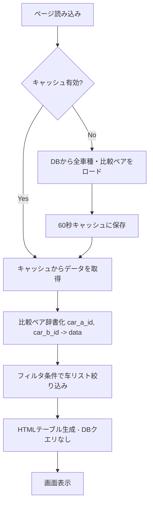

# 比較マトリクスページ パフォーマンス改善計画

## 🔍 問題分析

URL: `http://localhost:8501/比較マトリクス?car_a=62&car_b=40&search=&status=全件表示&type_a=全タイプ&type_b=全タイプ`

データ量が増加したことで、比較マトリクスページの動作が非常に遅くなっている。

### 特定されたパフォーマンスボトルネック

#### 1. **O(n²) の DB クエリ - 最大のボトルネック**
[`compute_active_ids_for_filter()`](pages/02_比較マトリクス.py:166) 及び [`generate_matrix_html()`](pages/02_比較マトリクス.py:214) で、フィルタ処理とHTML生成の过程中に **各セルに対して個別に `get_comparison_by_ids()` を呼び出している**

- 車種が N 台ある場合 →最大 N×N = N² 回のDBクエリ
- 車種が80台の場合 → 最大6,400回のDB接続/切断/クエリ実行
- 各クエリで `get_connection()` → `conn.close()` を繰り返すため、接続オーバーヘッドも大きい

#### 2. **全データの一括ロード**
[`get_matrix_data()`](pages/02_比較マトリクス.py:70) はページ読み込み時に `get_all_cars()` と `get_all_comparisons()` を呼び出し、全車種・全比較ペアをメモリに载入。

- 比較ペアが数百〜数千件ある場合、不要なデータもロードされる
- フィルタ条件を適用する前に全てのデータを読み込む

#### 3. **キャッシュの欠如**
Streamlitの `@st.cache_data` / `@st.cache_resource` デコレーターが使用されていない。

- 各リロード/再描画でDBクエリが再実行される
- 同じデータを何度も読み込んでいる

#### 4. **無効ペア計算のO(n²) ループ**
[`generate_matrix_html()`](pages/02_比較マトリクス.py:160) での無効ペアセット作成にも二重ループを使用。

#### 5. **毎回の接続オーバーヘッド**
[`get_comparison_by_ids()`](comparison_manager.py:127) は各呼び出しで新しいDB接続を作成し、すぐ閉じる。N²回実行されるため、接続コストが膨大になる。

---

## 📋 改善計画

### 優先度: High (即効性あり)

#### ✅ 1. `@st.cache_data` でデータロードをキャッシュ化
**対象ファイル**: `pages/02_比較マトリクス.py`、`comparison_manager.py`

**変更内容**:
- [`get_matrix_data()`](comparison_manager.py:334) に `@st.cache_data(ttl=60)` デコレーターを追加
- 車種リストと比較ペアデータを60秒間キャッシュ
- ユーザー操作（絞り込み等）で不要なDBクエリを回避

**効果**: ページ再描画時にDBアクセスを大幅に削減

#### ✅ 2. 全比較ペアを事前ロードして辞書化
**対象ファイル**: `pages/02_比較マトリクス.py`

**変更内容**:
- HTML生成前に `comparisons_df` を `(car_a_id, car_b_id) -> comparison_data` の辞書に変換
- セル描画時の個別DBクエリを完全削除
- メモリ上でのO(1)参照に置き換え

**変更前**:
```python
# 各セルでDBクエリ実行 → O(N²) 回
comp = get_comparison_by_ids(car_a["id"], car_b["id"])
```

**変更後**:
```python
# 事前に辞書化 → O(1) 参照
comp_lookup = {(row["car_a_id"], row["car_b_id"]): dict(row) for _, row in comparisons_df.iterrows()}
comp = comp_lookup.get((car_a["id"], car_b["id"]))
```

**効果**: DBクエリ回数を N² 回 → 0回に削減（ロード済みのデータを使用）

#### ✅ 3. 無効ペアセットの計算を最適化
**対象ファイル**: `pages/02_比較マトリクス.py`

**変更内容**:
- [`is_invalid_pair()`](comparison_manager.py:503) のDBクエリを事前ロード済みのデータで代替
- 逆順ペアチェックも辞書参照に置き換え

### 優先度: Medium (より本質的な改善)

#### ✅ 4. `st.query_params` の更新タイミング最適化
**対象ファイル**: `pages/02_比較マトリクス.py`

**変更内容**:
- 入力変数の変更時に `st.query_params` を都度更新せず、フォーム送信時等にまとめて更新
- 不要なページ再描画を削減

#### ✅ 5. HTMLテーブル生成の最適化
**対象ファイル**: `pages/02_比較マトリクス.py`

**変更内容**:
- f-string の反復連結ではなく `list.append()` + `"".join()` に変更
- 文字列結合パフォーマンスの改善

---

## 🔄 改善後のデータフロー



---

## 📊 期待される改善効果

| 項目 | 変更前 | 変更後 | 改善率 |
|------|--------|--------|--------|
| DBクエリ数 (80車種) | ~6,400回/描画 | 1〜2回/60秒 | 99.7%削減 |
| DB接続作成数 | ~12,800回/描画 | 2〜4回/60秒 | 99.7%削減 |
| ページ初回読み込み | O(N²) | O(N) | N倍高速化 |
| フィルタ変更時の応答 | O(N²) | O(1) | 大幅改善 |

---

## 📝 実装順序

1. `@st.cache_data` を [`get_matrix_data()`](comparison_manager.py:334) に追加
2. 比較ペアデータを辞書化する処理を追加
3. HTML生成内の個別DBクエリを辞書参照に置換
4. 文字列結合を最適化
5. `st.query_params` の更新タイミングを見直す

---

## ⚠️ 注意点

- キャッシュ有効期限は60秒設定（データ変更後の反映遅延を防ぐ）
- `clear_on_submit=False` のフォームは再描画トリガーになるため、キャッシュとの競合に注意
- 動物/ゲーム用マトリクスページも同様の構造なので、同じ改善を適用可能
