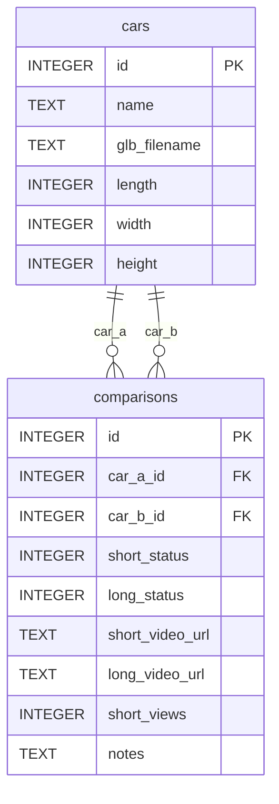

# 動画比較マトリクス管理システム 設計書

## 1. 概要

現在スプレッドシートで管理している「車同士の比較動画制作状況」を、既存のStreamlit Web管理画面に統合し、WEB上で直感的に管理できるシステムを設計する。

### 1.1 現在の管理方法
- スプレッドシートの行列形式で管理
- 縦軸: 車A、横軸: 車B の組み合わせ
- セルの色で制作状況を示す:
  - **白** = 未着手
  - **黄色** = ショート動画のみ作成済み
  - **オレンジ/緑** = ショート+長尺の両方作成済み（または長尺制作中）
  - **灰色** = 同じ車種自身、または既に作成済みの重複パターン（A vs B と B vs A は同じ比較）

### 1.2 目標
- ブラウザからマトリクス一覧を視覚的に確認できる
- 各組み合わせの制作状況をワンクリックで変更できる
- 統計ダッシュボードで進捗を把握できる
- `cars_config.json` との連動で、選択した比較ペアを即座にレンダリング可能

---

## 2. データベーススキーマ設計

### 2.1 新規テーブル: `comparisons`

既存の `cars` テーブルに動画制作状況を追跡する `comparisons` テーブルを追加する。

```sql
CREATE TABLE IF NOT EXISTS comparisons (
    id INTEGER PRIMARY KEY AUTOINCREMENT,
    car_a_id INTEGER NOT NULL,
    car_b_id INTEGER NOT NULL,
    short_status INTEGER DEFAULT 0,
    long_status INTEGER DEFAULT 0,
    short_video_url TEXT DEFAULT '',
    long_video_url TEXT DEFAULT '',
    short_views INTEGER DEFAULT 0,
    notes TEXT DEFAULT '',
    created_at TIMESTAMP DEFAULT CURRENT_TIMESTAMP,
    updated_at TIMESTAMP DEFAULT CURRENT_TIMESTAMP,
    FOREIGN KEY (car_a_id) REFERENCES cars(id),
    FOREIGN KEY (car_b_id) REFERENCES cars(id),
    UNIQUE(car_a_id, car_b_id)
);
```

| カラム名 | 型 | 説明 |
|---------|-----|------|
| id | INTEGER | 自動採番ID |
| car_a_id | INTEGER | 車AのcarsテーブルID (FK) |
| car_b_id | INTEGER | 車BのcarsテーブルID (FK) |
| short_status | INTEGER | ショート動画制作状況 (0=未着手, 1=制作中, 2=公開済み) |
| long_status | INTEGER | 長尺動画制作状況 (0=未着手, 1=制作中, 2=公開済み) |
| short_video_url | TEXT | ショート動画のYouTube URL |
| long_video_url | TEXT | 長尺動画のYouTube URL |
| short_views | INTEGER | ショート動画の視聴回数 (長尺制作の優先順位判定用) |
| notes | TEXT | メモ・備考 |
| created_at | TIMESTAMP | 登録日時 |
| updated_at | TIMESTAMP | 最終更新日時 |

### 2.2 データ関係図



---

## 3. WEB UI 画面設計

### 3.1 ページ構成 (Streamlitマルチページ)

既存の `web_manage_cars.py` に新しいタブを追加する。

```
┌─────────────────────────────────────────────────────┐
│              🚗 車種データベース管理                  │
├─────────────────────────────────────────────────────┤
│  [📋 車種一覧] [📊 比較マトリクス] [📈 ダッシュボード] │
├─────────────────────────────────────────────────────┤
│                                                     │
│  (各タブの内容)                                      │
│                                                     │
└─────────────────────────────────────────────────────┘
```

### 3.2 📊 比較マトリクスタブ

#### 3.2.1 フィルタセクション
```
┌─ フィルタ ──────────────────────────────────────────┐
│ 制作状況: [□未着手] [□ショートのみ] [□ショート+長尺] │
│ 車Aブランド: [全車種 ▼]                              │
│ 検索: [_____________]                                │
└─────────────────────────────────────────────────────┘
```

#### 3.2.2 マトリクス表示 - スプレッドシートを超えるUI設計

**スプレッドシートの課題:**
- 車名が縦書きで読みづらい
- 40台以上の車種だと画面が巨大になりすぎて見失う
- セルをクリックすると数値入力モードになってしまい、誤操作しやすい
- 色の意味を毎回確認する必要がある
- 同じ車種の自己比較や重複ペア (A vs B と B vs A) を灰色で隠しているが、なぜグレーかわかりにくい

**WEBマトリクスの改善点:**

1. **固定ヘッダー + スクロールボディ**: 縦軸の車名列と横軸の車名列は固定され、中央のセル領域のみ独立スクロール
2. **インラインステータス編集**: セルをクリックするとドロップダウンが展開し、ステータスを直接変更可能（誤数値入力の心配なし）
3. **常時表示ラジェンド**: 色の意味をマトリクス直下に常時表示
4. **無効ペアの明確な視覚表現**: 同じ車種や重複ペアは斜線パターン + グレーアウトで非クリック可能
5. **フィルタによる動的絞り込み**: 制作状況・ブランド・検索ワードで行列をリアルタイムフィルタ

```
┌──────────────────────────────────────────────────────────────────┐
│ [🔍 車名検索: __________] [状況: 全件▼] [ブランド: 全車種▼]      │
├──────────────────────────────────────────────────────────────────┤
│          ┌────────────────┬────────────────┬────────────────┐    │
│          │ ランドクルーザー │   マツダCX-5   │  カローラクロス │    │
│          │      250       │     2026       │     2025       │    │
├──────────┼────────────────┼────────────────┼────────────────┤    │
│ 日産ムラーノ│ 🟡 ショート▼  │ ⬜ 未着手 ▼   │ 🟢 両方完了 ▼ │    │
│   2027   ├────────────────┼────────────────┼────────────────┤    │
│          │ 🟡 ショート▼  │ ⫘ 重複ペア     │ ⬜ 未着手 ▼   │    │
│ ランドクル│                │ (B vs A)       │                │    │
│ ーザーFJ ├────────────────┼────────────────┼────────────────┤    │
│          │ ⫘ 同じ車種    │ 🟠 長尺制作中▼ │ 🔵 制作中 ▼   │    │
│ マツダCX-│ (自身比較)     │                │                │    │
│  -5 2026 ├────────────────┼────────────────┼────────────────┤    │
│          │ ⬜ 未着手 ▼   │ ⬜ 未着手 ▼   │ ⫘ 同じ車種    │    │
│ カローラ │                │                │ (自身比較)     │    │
│ クロス   └────────────────┴────────────────┴────────────────┘    │
│  2025                                                             │
├──────────────────────────────────────────────────────────────────┤
│ ラジェンド: ⬜未着手 │ 🔵制作中 │ 🟡ショート完了 │ 🟠長尺制作中 │    │
│           🟢両方完了 │ ⫘無効ペア(同じ車種/重複)                        │
└──────────────────────────────────────────────────────────────────┘
```

**セルのインライン編集ドロップダウン例:**
```
┌─────────────────────┐
│ 🟡 ショート完了 ▼   │ ← クリックで展開
├─────────────────────┤
│ ⬜ 未着手            │
│ 🔵 制作中            │
│ 🟡 ショート公開済み  │ ← 現在選択中
│ 🟠 長尺制作中        │
│ 🟢 両方公開済み      │
├─────────────────────┤
│ YouTube URL: [____] │
│ 視聴回数:    [4500] │
│ メモ:       [____] │
│ [💾 保存]           │
└─────────────────────┘
```

**セルの色定義:**
| 色 | 意味 | short_status | long_status | 備考 |
|----|------|-------------|-------------|------|
| ⬜ 白 | 未着手 | 0 | 0 | まだ動画を作成していない |
| 🔵 青 | ショート制作中 | 1 | 0 | ショート動画を制作中 |
| 🟡 黄色 | ショート完了 | 2 | 0 | ショート動画が公開されている |
| 🟠 オレンジ | 長尺制作中 | 2 | 1 | ショート完了 + 長尺を制作中 |
| 🟢 緑 | 両方完了 | 2 | 2 | ショートと長尺の両方が公開 |
| ⫘ グレー+斜線 | 無効ペア | - | - | 同じ車種の自身比較、または重複パターン(A vs B = B vs A) |

#### 3.2.3 セルクリックアクション - インライン編集
セルをクリックするとその場でドロップダウンが展開し、ステータス変更・URL入力・視聴回数更新を即座に行える。

```
┌─ 比較ペア詳細 ──────────────────────────────────────┐
│ 🚗 日産ムラーノ2027 vs ランドクルーザー250           │
│                                                     │
│ ショート動画: [🟡 公開済み]                          │
│   URL: [https://youtube.com/shorts/xxx___]          │
│   視聴回数: [4500]                                   │
│                                                     │
│ 長尺動画: [⬜ 未着手]                                │
│   URL: [_____________]                               │
│                                                     │
│ メモ: [_________________________________________]   │
│                                                     │
│ [ステータス更新] [cars_configに設定してレンダリング]  │
└─────────────────────────────────────────────────────┘
```

### 3.3 📈 ダッシュボードタブ

#### 3.3.1 概要統計カード
```
┌─────────────┐ ┌─────────────┐ ┌─────────────┐ ┌─────────────┐
│  全比較ペア  │ │  ショート   │ │  長尺完了   │ │  未着手     │
│    230件    │ │   45件      │ │    12件     │ │   173件     │
└─────────────┘ └─────────────┘ └─────────────┘ └─────────────┘
```

#### 3.3.2 進捗円グラフ
```
         制作状況内訳
    ┌──────────────┐
    │   ⬜ 未着手   │ ╭────────────────╮
    │      75%     │ │  🟡 ショートのみ │
    │              │ │       15%       │
    │              │ ╰────────────────╯
    │              │        🟢 完了 10%
    └──────────────┘
```

#### 3.3.3 長尺制作候補ランキング
ショート動画の視聴回数が高いペアを上位表示。

```
┌─ 長尺制作候補 (ショート視聴回数順) ──────────────────┐
│                                                     │
│ 1位 🏆 ルーミー vs エルグランド 2010    4803回      │
│ 2位 🥈 マツダCX-5 vs ランドクルーザーFJ   4500回    │
│ 3位 🥉 アルファード vs LFA               4000回     │
│ 4位     カローラクロス vs ランドクルーザー250  2213回 │
│ 5位     カローラクロス2026 vs ハリアー    2247回    │
│                                                     │
└─────────────────────────────────────────────────────┘
```

#### 3.3.4 車別比較カウント
各車が何回の比較ペアに含まれているか。

```
┌─ 車別比較回数 ──────────────────────────────────────┐
│                                                     │
│ ランドクルーザー250: ████████████ 12回               │
│ カローラクロス2026: ██████████ 10回                  │
│ ハリアー2025:       ████████ 8回                     │
│ マツダCX-5:         ███████ 7回                      │
│                                                     │
└─────────────────────────────────────────────────────┘
```

---

## 4. cars_config.json 連動機能

### 4.1 ワンクリックレンダリング準備
マトリクス画面で比較ペアを選択すると、`cars_config.json` に carA/carB のIDを書き込むボタンを提供。

```python
def set_comparison_pair(car_a_id: int, car_b_id: int):
    """cars_config.json に比較ペアを設定"""
    config = load_config()
    config["carA"]["id"] = str(car_a_id)
    config["carB"]["id"] = str(car_b_id)
    save_config(config)
    st.success(f"車A={car_a_id}, 車B={car_b_id} をcars_config.jsonに設定しました")
```

### 4.2 レンダリングショートカット
詳細パネルから直接以下のスクリプトを実行可能にする:
- `render_animation.py` (長尺)
- `animation_settings_short.py` (ショート)

---

## 5. 実装アーキテクチャ

### 5.1 ファイル構成

```
blender-vs-code/
├── web_manage_cars.py          # メインアプリ (マルチページ対応に改造)
├── pages/
│   ├── 02_比較マトリクス.py     # マトリクス表示ページ
│   └── 03_ダッシュボード.py     # 統計ダッシュボードページ
├── comparison_manager.py       # 比較ペアDB操作モジュール (新規)
├── cars.db                     # SQLiteデータベース (既存、スキーマ拡張)
└── cars_config.json            # レンダリング設定 (既存)
```

### 5.2 データフロー

```mermaid
flowchart TD
    subgraph UI[Streamlitアプリ]
        TAB1[車種一覧タブ]
        TAB2[比較マトリクスタブ]
        TAB3[ダッシュボードタブ]
    end
    
    subgraph Logic[ビジネスロジック]
        CM[comparison_manager.py]
        CR[car登録処理]
    end
    
    subgraph DB[(cars.db)]
        CARS[carsテーブル]
        COMP[comparisonsテーブル]
    end
    
    subgraph Config[設定ファイル]
        JSON[cars_config.json]
    end
    
    TAB1 --> CR
    TAB2 --> CM
    TAB3 --> CM
    CR --> CARS
    CM --> COMP
    CM --> CARS
    CM -->|ペア設定書き込み| JSON
```

---

## 6. comparison_manager.py モジュール設計

### 6.1 主要関数一覧

| 関数名 | 説明 |
|--------|------|
| `init_comparisons_table()` | comparisonsテーブル作成 |
| `get_all_comparisons()` | 全比較ペアを取得 |
| `get_comparison_by_ids(car_a_id, car_b_id)` | 指定ペアの情報を取得 |
| `get_comparisons_for_car(car_id)` | 指定車が関わる全ペアを取得 |
| `update_comparison_status(id, short_status, long_status)` | 制作状況を更新 |
| `update_comparison_url(id, video_type, url)` | YouTube URLを登録 |
| `update_short_views(id, views)` | ショート視聴回数を更新 |
| `get_matrix_data()` | マトリクス表示用データを取得 (車名付き) |
| `get_dashboard_stats()` | ダッシュボード統計データを取得 |
| `get_long_video_candidates(limit=10)` | 長尺制作候補を視聴回数順で取得 |
| `create_comparison_if_not_exists(car_a_id, car_b_id)` | ペアが存在しない場合は自動作成 |

### 6.2 マトリクスデータ生成ロジック

```python
def get_matrix_data():
    """
    マトリクス表示用のデータを生成
    
    戻り値: 
    - cars_list: 車種リスト (縦軸・横軸用)
    - matrix_grid: 2次元配列 [car_a_index][car_b_index] = status_info
    """
    # 1. 全車種を取得
    # 2. 全比較ペアを取得
    # 3. 車の組み合わせごとにステータスをマッピング
    # 4. 存在しないペアは「未着手」としてデフォルト値を返す
    pass
```

---

## 7. 実装ステップ

| 順 | タスク | ファイル | 詳細 |
|----|--------|---------|------|
| 1 | comparisonsテーブルのスキーマ定義とマイグレーション | `comparison_manager.py` | DB初期化関数作成 |
| 2 | comparison_manager.py モジュール作成 | `comparison_manager.py` | CRUD関数実装 |
| 3 | スプレッドシートデータの一括インポート機能 | `manage_cars.py` | 既存スプレッドシートの色情報をstatusに変換してインポート |
| 4 | Streamlitマルチページ構成への改造 | `web_manage_cars.py` | タブナビゲーション追加 |
| 5 | 比較マトリクスページ実装 | `pages/02_比較マトリクス.py` | 行列表示+セルクリックアクション |
| 6 | ダッシュボードページ実装 | `pages/03_ダッシュボード.py` | 統計カード+グラフ+ランキング |
| 7 | cars_config.json連動機能 | `comparison_manager.py` | ワンクリックペア設定 |
| 8 | テスト・動作確認 | - | ブラウザで全機能検証 |

---

## 8. スプレッドシートデータ移行戦略

### 8.1 色コード → ステータス変換ルール

| セルの背景色 | short_status | long_status | 備考 |
|-------------|-------------|-------------|------|
| 白 (塗りつぶしなし) | 0 | 0 | 未着手 |
| 黄色 | 2 | 0 | ショート動画のみ作成済み |
| オレンジ | 2 | 1 | ショート完了 + 長尺制作中 |
| 緑 | 2 | 2 | 両方公開済み |
| グレー | - | - | 無効ペア (同じ車種自身、または重複パターン) → DBに登録しない |

### 8.2 インポートスクリプトの考え方

手動でスプレッドシートの数値データ（視聴回数など）を比較ペアとして登録するフォームを提供するか、Excelファイルを読み込む機能を実装する。

灰色セルはDBに記録せず、マトリクス表示時に動的に「無効ペア」としてグレーアウト表示する。

---

## 9. 注意事項

- `cars_config.json` の構造は変更しない (id参照のみ)
- 既存の車種CRUD機能は維持
- DBスキーマ拡張は後方互換性を保つ (ALTER TABLEで追加)
- スプレッドシートのセル色情報は手動入力またはExcelインポートが必要
- **無効ペアの扱い**: 同じ車種の自身比較 (car_a_id == car_b_id) と、順序が逆な重複ペア (A vs B と B vs A) はDBに登録せず、マトリクス表示時に動的にグレーアウトする。これにより、n台の車種から有効な比較ペアは n*(n-1)/2 個になる
- **Streamlitの制約**: Streamlitはフルインタラクティブなインライン編集をサポートしないため、セルクリック → 右側パネルでの編集 というアプローチを採用する

---

## 10. スプレッドシートとの比較評価

| 項目 | スプレッドシート | WEBマトリクス |
|------|-----------------|--------------|
| 車名の可読性 | 縦書きで読みづらい | 横書き + フィルタで絞り込み可能 |
| 大規模対応 | 40台以上だと画面が巨大化 | スクロール + ページネーションで快適 |
| 編集のしやすさ | セルクリックで数値入力モードに | ドロップダウンで安全なステータス変更 |
| 色の意味 | 記憶が必要 | ラジェンド常時表示 |
| 無効ペアの扱い | グレーで隠しているが理由不明 | 斜線+「重複ペア」ラベルで明確 |
| 統計・分析 | 手動計算が必要 | ダッシュボードで自動集計 |
| YouTubeリンク | セル内に埋め込みづらい | クリックableなリンクとして管理 |
| レンダリング連携 | なし | ワンクリックでcars_config.json更新 |

**結論: WEBマトリクスはスプレッドシートを大幅に上回る見やすさと編集性を提供できる。**
