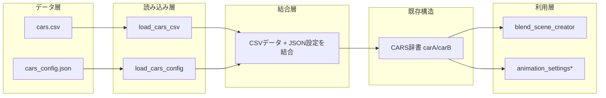

# CSV化による車種データ分離設計

## 概要

`cars_config.json` に直接記載していた車種固有データを CSV ファイルに分離し、JSON では ID のみで参照する仕組みに変更する。これにより、複数の車種を自由に組み合わせられる柔軟な構成を実現する。

---

## 1. 変更前の構成

### cars_config.json (現在)
```json
{
  "carA": {
    "name": "日産ムラーノ2027",
    "glb_path": "C:\\3d\\Modly\\glb\\murano2027.glb",
    "position": [2.0, 0.0, 0],
    "color": [0.5, 0.5, 0.5],
    "dimensions_mm": {
      "length": 4900,
      "width": 1980,
      "height": 1725,
      "ground_clearance": 210,
      "turning_radius": 5600
    },
    "acceleration_0_to_100_km_h": 10.0,
    "rotation_z_degrees": 0
  },
  "carB": { ... }
}
```

### データフロー
```
cars_config.json → load_cars_config() → CARS 辞書 → blend_scene_creator / animation_settings*
```

---

## 2. 変更後の構成

### 2.1 cars.csv (新規作成)

| id | name | glb_filename | length | width | height | ground_clearance | turning_radius | acceleration_0_to_100 | rotation_direction |
|----|------|-------------|--------|-------|--------|-----------------|----------------|----------------------|-------------------|
| MURANO2027 | 日産ムラーノ2027 | murano2027.glb | 4900 | 1980 | 1725 | 210 | 5600 | 10.0 | 0 |
| LANDCRUISER250 | ランドクルーザー 250 2025 | landCluser250-8.5-20000.glb | 4925 | 1940 | 1925 | 230 | 5800 | 14.0 | 0 |

**カラム定義:**
| カラム名 | 型 | 説明 |
|---------|-----|------|
| id | string | 一意の識別子（大文字英数字・アンダースコア） |
| name | string | 車名（日本語OK） |
| glb_filename | string | GLBファイル名（ディレクトリパスは含まない） |
| length | int | 全長 (mm) |
| width | int | 全幅 (mm) |
| height | int | 全高 (mm) |
| ground_clearance | int | 最低地上高 (mm) |
| turning_radius | int | 最小回転半径 (mm) |
| acceleration_0_to_100 | float | 0-100km/h加速時間 (秒) |
| rotation_direction | int | Z軸回転角度（度、メッシュ回転用） |

### 2.2 cars_config.json (変更後)

```json
{
  "glb_dir": "C:\\3d\\Modly\\glb",
  "carA": {
    "id": "MURANO2027",
    "color": [0.5, 0.5, 0.5],
    "position": [2.0, 0.0, 0]
  },
  "carB": {
    "id": "LANDCRUISER250",
    "color": [0.0, 0.7, 1.0],
    "position": [-2.0, 0.0, 0]
  }
}
```

**変更点:**
- `glb_dir`: GLBファイルの共通ディレクトリパス（グローバル設定）
- carA/carB: `id`（CSV参照用）、`color`、`position` のみ保持
- 寸法データは CSV から自動取得

---

## 3. コード変更設計

### 3.1 データフロー変更後

```
cars.csv ──┐
           ├→ load_cars_config() → CARS 辞書（既存構造を維持） → blend_scene_creator / animation_settings*
cars.json ─┘
```

### 3.2 `blend_scene_creator.py` の変更

#### 新規関数: `load_cars_csv()`
```python
def load_cars_csv():
    """cars.csv から車種マスターデータを辞書として読み込む"""
    csv_path = os.path.join(SCRIPT_DIR, "cars.csv")
    cars_db = {}
    with open(csv_path, "r", encoding="utf-8-sig") as f:
        reader = csv.DictReader(f)
        for row in reader:
            car_id = row["id"]
            cars_db[car_id] = {
                "name": row["name"],
                "glb_filename": row["glb_filename"],
                "length": int(row["length"]),
                "width": int(row["width"]),
                "height": int(row["height"]),
                "ground_clearance": int(row["ground_clearance"]),
                "turning_radius": int(row["turning_radius"]),
                "acceleration_0_to_100": float(row["acceleration_0_to_100"]),
                "rotation_direction": int(row["rotation_direction"])
            }
    return cars_db
```

#### 修正関数: `load_cars_config()`
```python
def load_cars_config():
    """JSON設定 + CSVデータを結合してCARS辞書を返す"""
    # 1. JSON読み込み
    config_path = os.path.join(SCRIPT_DIR, "cars_config.json")
    with open(config_path, "r", encoding="utf-8") as f:
        config = json.load(f)
    
    # 2. CSV読み込み（車種マスターDB）
    cars_db = load_cars_csv()
    
    # 3. glb_dir の取得
    glb_dir = config.get("glb_dir", "")
    
    # 4. carA/carB ごとにCSVデータを結合
    merged = {}
    for key in ["carA", "carB"]:
        if key not in config:
            continue
        
        car_cfg = config[key]
        car_id = car_cfg.get("id", "")
        
        if car_id not in cars_db:
            print(f"エラー: CSVにID '{car_id}' が見つかりません")
            sys.exit(1)
        
        csv_data = cars_db[car_id]
        merged[key] = {
            "name": csv_data["name"],
            "glb_path": os.path.join(glb_dir, csv_data["glb_filename"]),
            "position": tuple(car_cfg.get("position", [0.0, 0.0, 0])),
            "color": tuple(car_cfg.get("color", [0.5, 0.5, 0.5])),
            "dimensions_mm": {
                "length": csv_data["length"],
                "width": csv_data["width"],
                "height": csv_data["height"],
                "ground_clearance": csv_data["ground_clearance"],
                "turning_radius": csv_data["turning_radius"]
            },
            "acceleration_0_to_100_km_h": csv_data["acceleration_0_to_100"],
            "rotation_z_degrees": csv_data["rotation_direction"]
        }
    
    return merged
```

### 3.3 互換性の維持

`load_cars_config()` が返す CARS 辞書の構造は**既存と完全に同一**であるため、以下のコード変更は不要:

- `blend_scene_creator.py`: `car_data['name']`, `car_data['glb_path']` など
- `animation_common.py`: `car_dimensions.get("carA", {}).get("length", 0)` など
- `animation_settings*.py`: `imported_cars.get("carA")` など

---

## 4. アーキテクチャ図



---

## 5. 実装順序

| 順 | タスク | ファイル | 影響範囲 |
|----|--------|---------|---------|
| 1 | cars.csv を新規作成 | `cars.csv` | 新規ファイル |
| 2 | cars_config.json を新フォーマットに変更 | `cars_config.json` | JSON構造変更 |
| 3 | load_cars_csv() を追加 | `blend_scene_creator.py` | 新規関数追加 |
| 4 | load_cars_config() を修正 | `blend_scene_creator.py` | 既存関数修正 |
| 5 | Blenderでテスト実行 | - | 動作確認 |

---

## 6. リスクと対応

| リスク | 影響 | 対応策 |
|--------|------|--------|
| CSVエンコーディング問題 | 日本語車名が化ける | `utf-8-sig` で読み込み（BOM対応） |
| IDのタイプミス | 実行時エラー | IDNotFound時の明確なエラーメッセージ |
| GLBディレクトリ変更 | パス解決失敗 | glb_dir をJSONで一元管理 |
| animation_settings_short.py の参照 | carA/carB キー依存 | CARS構造を維持するため影響なし |

---

## 7. 拡張性

この設計により、以下のような柔軟な運用が可能になる:

- **新車種の追加**: CSVに1行追加するのみ
- **組み合わせの変更**: JSONの id を書き換えるのみ
- **寸法の修正**: CSVを編集するのみ（JSONは触らない）
- **複数の比較ペア**: JSONに carC, carD を追加可能（将来的な拡張）
