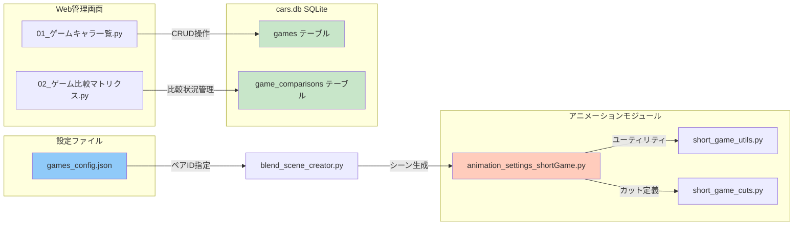
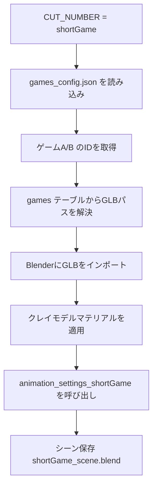

# ゲームキャラクター比較機能 設計仕様書

## 概要

Blender x LLM 自動車比較動画システムに「ゲームキャラクターの比較動画」機能を追加する。

- **コマンド**: `python run.py shortGame`
- **GLBディレクトリ**: `C:\3d\Modly\glb_game`
- **アニメーション構造**: Short2（縦長9:16、カット1円弧パンニング + カット2トップダウン→復帰）
- **データ項目**: キャラ名、ゲーム名、全高(mm)、全長(mm)

---

## 全体アーキテクチャ



---

## 1. games_config.json の仕様

cars_config.json / animals_config.json のパターンを踏襲する。

```json
{
  "glb_dir": "C:\\3d\\Modly\\glb_game",
  "gameA": {
    "id": "1",
    "color": [0.5, 0.5, 0.5],
    "position": [2.0, 0.0, 0]
  },
  "gameB": {
    "id": "2",
    "color": [0.0, 0.7, 1.0],
    "position": [-2.0, 0.0, 0]
  }
}
```

---

## 2. DB スキーマ設計

### 2.1 games テーブル

| カラム名 | タイプ | 説明 |
|---------|--------|------|
| id | INTEGER PK | 自動採番 |
| name | TEXT NOT NULL | キャラクター名 |
| game_name | TEXT DEFAULT '' | 所属ゲームタイトル |
| glb_filename | TEXT DEFAULT '' | GLBファイル名 |
| height | REAL DEFAULT 0 | 全高 (mm) |
| length | REAL DEFAULT 0 | 全長 (mm) |
| rotation_direction | REAL DEFAULT 0 | 回転方向補正値 |
| color_name | TEXT DEFAULT 'グレー' | クレイモデル色名 |

### 2.2 game_comparisons テーブル

| カラム名 | タイプ | 説明 |
|---------|--------|------|
| id | INTEGER PK | 自動採番 |
| game_a_id | INTEGER NOT NULL | FK → games.id |
| game_b_id | INTEGER NOT NULL | FK → games.id |
| short_status | INTEGER DEFAULT 0 | ショート動画制作状況 (0-5) |
| long_status | INTEGER DEFAULT 0 | 長尺動画制作状況 (0-3) |
| short_video_url | TEXT DEFAULT '' | YouTubeショートURL |
| long_video_url | TEXT DEFAULT '' | YouTube長尺URL |
| short_views | INTEGER DEFAULT 0 | ショート視聴数 |
| long_views | INTEGER DEFAULT 0 | 長尺視聴数 |
| notes | TEXT DEFAULT '' | メモ |
| created_at | TIMESTAMP | 作成日時 |
| updated_at | TIMESTAMP | 更新日時 |

---

## 3. comparison_manager.py に追加する関数

動物系の関数を基準にゲーム系を追加する。

| 関数名 | 説明 |
|--------|------|
| `init_games_table()` | gamesテーブルを作成 |
| `init_game_comparisons_table()` | game_comparisonsテーブルを作成 |
| `get_all_games()` | 全キャラクターデータを取得 |
| `get_all_game_comparisons()` | 全比較ペアを取得（キャラ名付き） |
| `get_games_db_dict()` | キャラクターマスターを辞書として読み込み |
| `get_game_comparison_by_ids(game_a_id, game_b_id)` | ペアの情報を取得 |
| `create_game_comparison_if_not_exists()` | ペアを自動作成 |
| `update_game_comparison_full()` | 比較ペアの一括更新 |
| `update_game_comparison_url()` | YouTube URLを登録 |
| `get_game_matrix_data()` | マトリクス表示用データを生成 |
| `set_game_comparison_pair_to_config()` | games_config.jsonにペアを書き出し |
| `search_games(query)` | 文字列検索 |
| `add_game(name, game_name, glb_filename, height, length, ...)` | 新規追加 |
| `update_game(id, ...)` | 編集 |
| `delete_game(id)` | 削除 |

---

## 4. run.py の変更点

### 4.1 CUTS定義に shortGame を追加

```python
"shortGame": {"start": 0, "end": 624, "label": "ゲームキャラクターショート動画（縦長9:16、Short2構造、約26秒@24fps）"},
```

### 4.2 シード値の扱い

short2と同様に STRATEGY_SEED 環境変数を渡す。

---

## 5. アニメーションモジュール

### 5.1 animation_settings_shortGame.py

Short2（`animation_settings_short2.py`）の構造をベースに、ゲームキャラクター向けに調整する。

**主な変更点:**
- キャラA/B の読み込みは `games_config.json` から
- 全高データの活用（カメラターゲット高度計算など）
- ショート2と同じカット構成: カット1(円弧パンニング) + カット2(トップダウン→復帰)

### 5.2 short_game_utils.py

Short2のユーティリティ関数を流用・調整。

| 関数 | 説明 |
|------|------|
| `get_character_visual_center_offset(obj)` | 視覚的中心補正オフセット計算 |
| `clear_animation_data(objects)` | アニメーションデータクリア |

### 5.3 short_game_cuts.py

Short2のカット定義を流用・調整。

| 関数 | 説明 |
|------|------|
| `setup_cut1_overlap(...)` | カット1: 円弧パンニング + キャラスライド |
| `setup_cut2_phase_a_topdown(...)` | カット2フェーズA: トップダウン移動 |
| `setup_cut2_phase_b_camera_return(...)` | カット2フェーズB: カメラ復帰 + キャラスライド復帰 |

---

## 6. blend_scene_creator.py の変更点

既存の `CUT_NUMBER` 判定ロジックに `shortGame` ケースを追加。

```python
if cut_number == "shortGame":
    # games_config.json を読み込み
    # games データベースを参照してGLBをインポート
    # animation_settings_shortGame.setup_shortGame_animations() を呼び出し
```

### 変更フロー



---

## 7. Streamlit Webページ

### 7.1 pages/01_ゲームキャラ一覧.py

動物一覧（`pages/01_動物一覧.py`）のパターンを踏襲。紫系のボタンカラーで差別化。

| 項目 | 説明 |
|------|------|
| タイトル | 🎮 ゲームキャラクター一覧 |
| ページアイコン | 🎮 |
| 操作 | 新規追加・編集・削除・検索 |
| データ項目 | ID, キャラ名, ゲーム名, GLBファイル名, 全高, 全長 |

### 7.2 pages/02_ゲーム比較マトリクス.py

動物比較マトリクス（`pages/02_動物比較マトリクス.py`）のパターンを踏襲。紫系のボタンカラーで差別化。

| 項目 | 説明 |
|------|------|
| タイトル | 🎮 ゲーム比較マトリクス |
| ページアイコン | 🎮 |
| 操作 | 行列形式の比較状況確認・編集 |
| フィルタ | 検索、制作状況フィルタ |

---

## 8. カテゴリ別のカラー戦略

既存のカテゴリとの差別化のため、以下のカラーを使用する:

| カテゴリ | カラー | ページ |
|---------|--------|--------|
| 車 | 青系 (#1E88E5) | 🚗 |
| 動物 | 緑系 (#43A047) | 🐾 |
| ゲーム | 紫系 (#AB47BC) | 🎮 |

---

## 9. 実装順序

1. `games_config.json` を作成
2. `comparison_manager.py` にゲーム関連DB関数を追加
3. `run.py` に shortGame コマンドを追加
4. `animation_settings_shortGame.py` + `short_game_utils.py` + `short_game_cuts.py` を作成
5. `blend_scene_creator.py` にゲーム読み込みロジックを追加
6. `pages/01_ゲームキャラ一覧.py` を作成
7. `pages/02_ゲーム比較マトリクス.py` を作成
