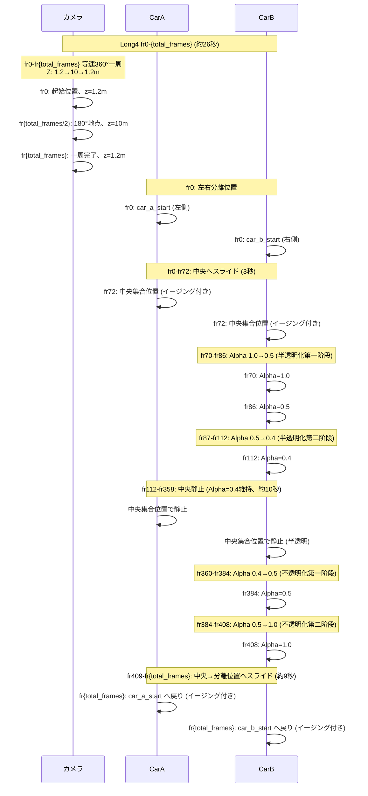

# Long4の仕様.md

## 1. 概要
- **Short4のアニメーションパターンを横長フォーマット（16:9）で実現したバージョン**
- **カメラ: fr0-fr{total_frames}で円弧上を等速で360°一周（約24-28秒ランダム±2秒）、Z高さはサイン波変化 (1.2→10→1.2m)**
- **車: 左右分離位置→中央スライド→半透明化→不透明化→分離位置へスライド の一連フロー**
- YouTube長尺動画向けの横長フォーマット（16:9 / 1920x1080）

## 2. フォーマット設定
- 解像度: 1920x1080（横長16:9 / 1080p）
- フレームレート: 24fps
- 総フレーム数: 576-672フレーム（約24-28秒、±2秒ランダム化）
- カメラ回転完了: fr{total_frames}（約24-28秒、一周完了＝動画終了）
- 出力ファイル名: `long4_overlap.mp4`

## 3. 車のアニメーション — Short4と同じパターン（フレーム数2倍化）

### 3-1. スライドインフェーズ (fr0-fr72, ~3秒)
- **フレーム0**: 2台の車が左右に離れた開始位置に配置
  - CarA: (-1.25 * char_scale, rear_offset_y)
  - CarB: (1.25 * char_scale, 0.0)
- **フレーム1-72 (3秒)**: 中央集合位置へスライド（イージング付き）
  - イージング関数: `_ease_in_out_cubic`（滑らかな加減速）

### 3-2. 半透明化フェーズ (fr70-fr112, ~2秒)
- **fr70-fr86 (第一阶段, 約0.67秒)**: Alpha 1.0→0.5
- **fr86-fr112 (第二阶段, 約1.08秒)**: Alpha 0.5→0.4
- 透明度対象車: CarB（固定）

### 3-3. 半透明静止フェーズ (fr112-fr358, ~10.25秒)
- CarA, CarB: 中央集合位置で静止（重なったまま）
- 透明度対象車: Alpha=0.4 で半透明維持

### 3-4. 不透明化フェーズ (fr360-fr408, ~2秒)
- **fr360-fr384 (第一阶段, 約1秒)**: Alpha 0.4→0.5
- **fr384-fr408 (第二阶段, 約1秒)**: Alpha 0.5→1.0
- fr408で完全に不透明化

### 3-5. スライドアウトフェーズ (fr409-fr624, ~9秒)
- CarA, CarB: 中央集合位置から左右に離れた開始位置へゆっくりスライド（イージング付き）
- fr624で両車が分離位置に到達（終了状態）

---

## 4. カメラ — 円弧等速360°一周（Zサイン波、約26秒完了）

### 4-1. 概要
- **fr0-fr{total_frames}**: 円弧上を等速で360°一周（約24-28秒）、Z高さはサイン波変化 (1.2→10→1.2m)
- 起始位置から負方向（時計回り）に2πラジアン回転

### 4-2. カメラ動作の詳細
- **円弧パラメータ**:
  - 中心: (0, 0)
  - 半径: arc_radius = sqrt(cam_start_x^2 + cam_start_y^2)（スケール適用後）
  - Z高さ: サイン波で変化 — fr0: z=1.2m → fr{total_frames/2}(180°): z=10m → fr{total_frames}(360°): z=1.2m
- **補間方式**: LINEAR（等速移動、イージングなし）
- **キーフレーム間隔**: 1フレームごと（滑らかな円弧のため）

---

## 5. CarBの半透明化 — Short4と同じ4段階透明度パターン（2倍スケール）

| フレーム範囲 | Alpha値 | 説明 |
|------------|---------|------|
| fr0-fr69 | 1.0 | 不透明（スライドイン中） |
| fr70-fr86 | 1.0→0.5 | 半透明化第一阶段: 漸減 (約0.67秒) |
| fr87-fr112 | 0.5→0.4 | 半透明化第二阶段: 完全半透明化 (約1.08秒) |
| fr112-fr358 | 0.4 | 半透明維持（中央静止、約10.25秒） |
| fr360-fr384 | 0.4→0.5 | 不透明化第一阶段: 漸増 (約1秒) |
| fr384-fr408 | 0.5→1.0 | 不透明化第二阶段: 完全不透明化 (約1秒) |
| fr409-fr{total_frames} | 1.0 | 不透明維持（分離位置へスライド） |

---

## 6. 全体のフロー図



## 7. フレーム構成まとめ

| 区間 | カメラ動作 | 車の動作 | CarB透明度 |
|------|-----------|---------|-----------|
| fr0-fr72 | 360°一周の進行中（約42%） | fr0: 分離→fr72: 中央スライド完了 | 1.0維持 |
| fr70-fr86 | 360°一周の進行中 | 中央で静止 | 1.0→0.5 (半透明化第一阶段) |
| fr87-fr112 | 360°一周の進行中 | 中央で静止 | 0.5→0.4 (半透明化第二阶段) |
| fr112-fr358 | 360°一周の進行中（約43%） | 中央で静止 | 0.4維持 |
| fr360-fr384 | 360°一周の進行中 | 中央で静止 | 0.4→0.5 (不透明化第一阶段) |
| fr384-fr408 | 360°一周の進行中 | 中央で静止 | 0.5→1.0 (不透明化第二阶段) |
| fr409-fr{total_frames} | 360°一周の完了（約28%） | 中央→分離位置へスライド（約9秒） | 1.0維持 |

## 8. ファイル構成

| ファイル | 説明 |
|----------|------|
| [`animation_settings_long4.py`](../animation_settings_long4.py) | メインオーケストレーション (total_frames=576-672、カメラ一周完了) |
| [`long4_cuts.py`](../long4_cuts.py) | カット位置アニメーションモジュール |
|  | `setup_arc_full_circle()` - fr0-fr{total_frames}で等速360°一周 + 新車アニメーション |

## 9. 実行方法
```bash
python run.py long4
```

## 10. Short4との違い

| 項目 | Short4 | Long4 |
|------|--------|-------|
| フォーマット | 縦長9:16 (1080x1920) | 横長16:9 (1920x1080) |
| 総フレーム数 | 288-336 (約12-14秒) | 576-672 (約24-28秒) |
| スライドイン時間 | 約1.5秒 (fr36) | 約3秒 (fr72) |
| 半透明化時間 | 約1秒 (fr35-56) | 約2秒 (fr70-112) |
| 半透明静止時間 | 約5.1秒 (fr56-179) | 約10.3秒 (fr112-358) |
| 不透明化時間 | 約1秒 (fr180-204) | 約2秒 (fr360-408) |
| スライドアウト時間 | 約4.5秒 (fr205-312) | 約9秒 (fr409-624) |
| カメラ回転速度 | 速め（約13秒で一周） | ゆっくり（約26秒で一周） |

## 11. Long3との違い

| 項目 | Long3 | Long4 |
|------|-------|-------|
| カメラ動作 | カット1: 円弧パンニング、カット2A: トップダウン、カット2B: 復帰 | fr0-fr{total_frames}全体で等速360°一周（Zサイン波） |
| 車の開始状態 | fr0: 中央で重なり | fr0: 左右分離位置 |
| 透明度パターン | 3段階 (CONSTANT補間) | 4段階 (半透明化2段階 + 不透明化2段階, LINEAR+CONSTANT混合補間) |
| カメラZ高さ | 一定（トップダウン時は真上） | サイン波 (1.2m→10m→1.2m) |
