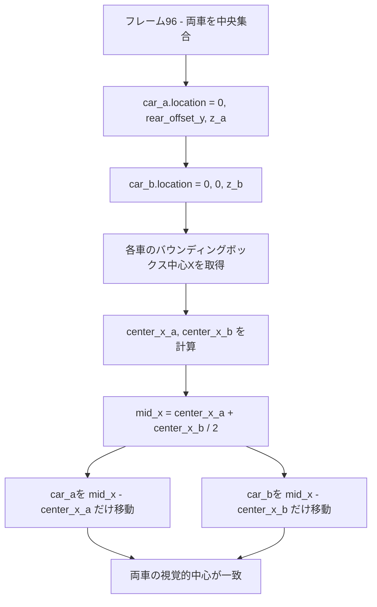

# シーン1 - 両車X座標中央揃え修正計画

## 問題概要

シーン1（フレーム0-96）でCarAとCarBが中央に集合する際、両車のエンド位置は`(0.0, 0.0)`に設定されているが、各GLBモデルの原点位置が異なるため**視覚的な車の中心が一致せず、X座標方向にズレが生じる**。

## 原因分析

- [`blend_scene_creator.py`](blend_scene_creator.py:453)で`origin_set(type='GEOMETRY_ORIGIN', center='MEDIAN')`を実行している
- 各車の形状・寸法が異なるため、「幾何学的中心」の定義が車ごとに異なる
- 同じ`(0.0, 0.0)`座標に移動しても、バウンディングボックスの視覚的中心がズレる

## 解決策

フレーム96で両車の**バウンディングボックス中心X座標**を計算し、中央値を求める。それぞれの車をその中央位置に補正移動させる。

### 補正ロジックの流れ



## 実装計画

### 変更ファイル
- [`animation_settings_cut1.py`](animation_settings_cut1.py)

### 追加関数

```python
def get_car_visual_center_x(car_obj):
    """車のバウンディングボックスから視覚的な中心X座標を取得"""
    bounds = [Vector(b) for b in car_obj.bound_box]
    corners_world = [car_obj.matrix_world @ corner for corner in bounds]
    min_x = min(c.x for c in corners_world)
    max_x = max(c.x for c in corners_world)
    return (min_x + max_x) / 2.0
```

### 変更箇所

フレーム96の処理後、両車のX座標を補正するコードを追加する。

```python
# フレーム96で両車を中央集合した後
# 視覚的中心X座標を取得
center_x_a = get_car_visual_center_x(car_a)
center_x_b = get_car_visual_center_x(car_b)

# 中央X座標を計算
mid_x = (center_x_a + center_x_b) / 2.0

# 各車を補正移動
car_a.location.x = car_a.location.x + (mid_x - center_x_a)
car_b.location.x = car_b.location.x + (mid_x - center_x_b)

# キーフレームを更新
car_a.keyframe_insert(data_path="location", frame=96)
car_b.keyframe_insert(data_path="location", frame=96)
```

## 影響範囲

- フレーム96以降の車の位置が変更される
- カット2以降の処理は`cut1_result`の`car_a_end`/`car_b_end`値を使用するため、自動的に追従する
- テキストラベルは車にペアレント設定されているため、自動追従する

## テスト方法

1. Blenderでスクリプトを実行
2. フレーム96に移動し、両車のX座標が視覚的に一致していることを確認
3. トップビューからX軸方向のズレがないことを確認
