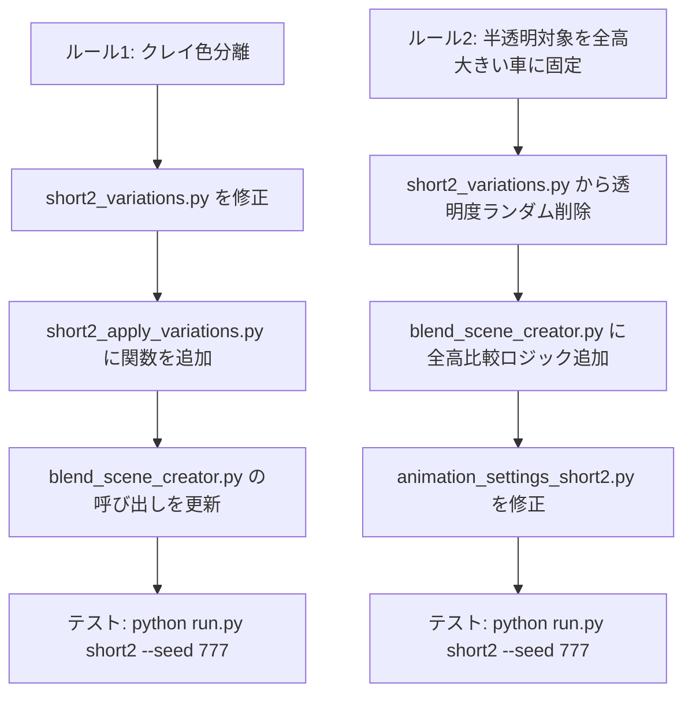

# Short2 バリエーション機能 - 新ルール追加設計書

## 概要

Short2バリエーション機能のデバッグ完了後、以下の2つのルールの追加を提案します。

| ルール | 内容 | 理由 |
|--------|------|------|
| ルール1 | CarAとCarBは必ず違うクレイ色にする | 同じ色だと視覚的に区別できない |
| ルール2 | 半透明化対象は体積（全長×全幅×全高）が大きい車に固定 | 大きな車が前面に半透明で重なる演出により、奥行き感と比較の効果が上がる |

---

## ルール1: CarAとCarBのクレイ色を必ず異にする

### 現状の問題

[`short2_variations.py`](short2_variations.py:159-163) の `generate_strategy_config()` は以下のように単一のクレイ色を選択し、両車に同じ色を適用しています。

```python
config = {
    "clay_color": rng.choice(CLAY_COLOR_PRESETS),  # ← 1色のみ
}
```

[`short2_apply_variations.py`](short2_apply_variations.py:46-67) の `apply_clay_colors()` では、`clay_` で始まる全マテリアルに同じ色が適用されます。

### 変更内容

#### 1. `short2_variations.py` — 色選択ロジックを変更

**Before:**
```python
"clay_color": rng.choice(CLAY_COLOR_PRESETS),
```

**After:**
```python
# CarAとCarBで異なる色をランダムに選択
clay_a = rng.choice(CLAY_COLOR_PRESETS)
clay_b = rng.choice([c for c in CLAY_COLOR_PRESETS if c["name"] != clay_a["name"]])
"clay_color_a": clay_a,
"clay_color_b": clay_b,
```

#### 2. `short2_apply_variations.py` — 車ごとの色適用関数を追加

新しい関数 `apply_clay_colors_per_car(clay_color_a, clay_color_b)` を追加し、マテリアル名から対象車を判定して異なる色を適用する。

```python
def apply_clay_colors_per_car(clay_color_a, clay_color_b):
    """車ごとに異なるクレイ色を適用"""
    for mat in bpy.data.materials:
        if not mat.name.startswith("clay_"):
            continue
        # マテリアル名から carA/carB を判定
        color = clay_color_a["color"] if "carA" in mat.name else clay_color_b["color"]
        if mat.use_nodes:
            for node in mat.node_tree.nodes:
                if node.type == 'BSDF_PRINCIPLED':
                    node.inputs['Base Color'].default_value = (*color, 1.0)
                    break
    print(f"  ✅ クレイ色変更: CarA={clay_color_a['name']}, CarB={clay_color_b['name']}")
```

#### 3. `blend_scene_creator.py` — 呼び出し箇所を更新

`apply_clay_colors(SHORT2_CONFIG["clay_color"])` を、新しい関数に置き換える。

### 影響ファイル

| ファイル | 変更内容 |
|----------|---------|
| `short2_variations.py` | `generate_strategy_config()` の clay_color 部分を2色選択に変更 |
| `short2_apply_variations.py` | `apply_clay_colors_per_car()` 関数を追加 |
| `blend_scene_creator.py` | クレイ色適用部分を更新 (1407-1422行目あたり) |

---

## ルール2: 半透明対象を全高が大きい車に固定

### 現状の問題

[`short2_variations.py`](short2_variations.py:82) の `TRANSPARENCY_TARGET` はランダム選択です。

```python
TRANSPARENCY_TARGET = ["carB", "carA"]  # ランダム選択
```

半透明化の意味は「大きい車が前面にあって、小さい車が後ろで透けて見える」演出のため、全高が大きい車を半透明にする方が効果的です。

### 変更内容

#### 1. `short2_variations.py` — 半透明対象のランダム選択を削除

**Before:**
```python
"transparency_target": rng.choice(TRANSPARENCY_TARGET),
```

**After:**
このキーをconfigから削除します。代わりに、`blend_scene_creator.py` で cars_config.json から車の全高を読み取り、動的に判定する方が柔軟です。

#### 2. `blend_scene_creator.py` — 全高比較ロジックを追加

すでにGLBインポート後に車の寸法データが取得できるため（cars_config.json に `height` フィールドがある場合）、以下のように判定します。

```python
# 半透明対象を全高が大きい車に設定
height_a = CARS.get("carA", {}).get("height", 0)
height_b = CARS.get("carB", {}).get("height", 0)
transparency_target = "carB" if height_b > height_a else "carA"
print(f"  半透明対象: {transparency_target} (全高比較: carA={height_a}mm, carB={height_b}mm)")
```

#### 3. `animation_settings_short2.py` — strategy_config依存を排除

129-138行目で `strategy_config["transparency_target"]` を参照している箇所を、グローバル変数または引数経由で渡す形に変更します。

### 影響ファイル

| ファイル | 変更内容 |
|----------|---------|
| `short2_variations.py` | `TRANSPARENCY_TARGET` リストと `transparency_target` キーを削除 |
| `blend_scene_creator.py` | 全高比較ロジックを追加し、半透明対象を決定 |
| `animation_settings_short2.py` | strategy_configからの透明度対象取得を引数経由に変更 |

---

## 実施順序



## 注意事項

1. `cars_config.json` は変更不可のため、車の寸法は既存のDBから読み取る
2. クレイ色のプリセットは現在5種類のため、常に異なる色を選択可能（最悪4×4=16通りの組み合わせ）
3. バックワード互換性: seed固定で再生成した場合、設定構造が変化する点をログ出力で明示
