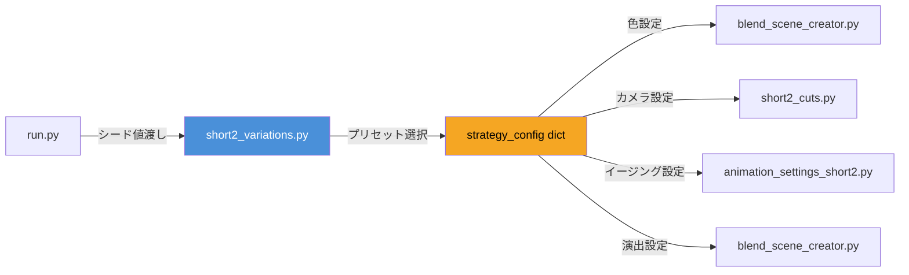
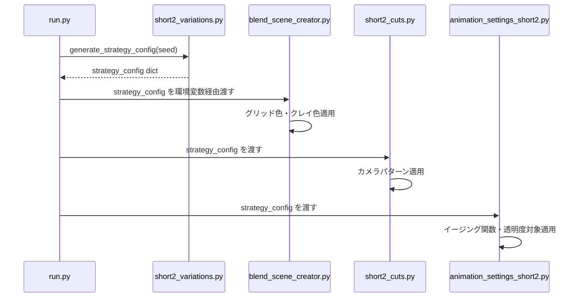

# Short2 バリエーションシステム 設計書

## 1. 概要

Short2の動画を毎回異なる見た目・動きにするために、ランダム組み合わせ方式による変数化管理システムを導入する。

### 目標
- 同じ車種を指定しても、実行するたびに異なる動画に見える
- ハードコーディングの変更なしに、コマンド一発でバリエーション生成
- コアロジックは変更せず、設定パラメータのみを変動させる

## 2. システム全体アーキテクチャ



## 3. モジュール構成

### 3.1 新規: `short2_variations.py`

すべてのバリエーションのプリセット定義とランダム選択ロジックを一元管理するモジュール。

#### 3.1.1 色パレットプリセット (strategy 1)

```python
GRID_COLOR_PRESETS = [
    {"name": "cyan",         "color": (0.0, 0.8, 1.0),   "emission": 2.0},
    {"name": "orange",       "color": (1.0, 0.5, 0.0),   "emission": 2.0},
    {"name": "magenta",      "color": (1.0, 0.0, 0.8),   "emission": 2.0},
    {"name": "lime_green",   "color": (0.3, 1.0, 0.2),   "emission": 2.0},
    {"name": "purple",       "color": (0.6, 0.0, 1.0),   "emission": 2.0},
    {"name": "red",          "color": (1.0, 0.15, 0.15), "emission": 2.0},
]

CLAY_COLOR_PRESETS = [
    {"name": "white_gray",   "color": (0.85, 0.85, 0.87)},
    {"name": "warm_gray",    "color": (0.72, 0.68, 0.64)},
    {"name": "vivid_orange", "color": (0.95, 0.55, 0.25)},
    {"name": "clay_brown",   "color": (0.75, 0.58, 0.42)},
    {"name": "ice_blue",     "color": (0.65, 0.78, 0.90)},
]

BACKGROUND_GLOW_PRESETS = [
    {"name": "subtle_cyan",  "color": (0.0, 0.15, 0.2),  "strength": 0.3},
    {"name": "dark_orange",  "color": (0.15, 0.08, 0.0), "strength": 0.2},
    {"name": "none",         "color": (0.0, 0.0, 0.0),   "strength": 0.0},
]
```

#### 3.1.2 カメラパターンプリセット (strategy 2)

```python
CAMERA_PATTERNS = [
    {
        "name": "standard_arc_lr",       # 標準: 左→右円弧パン
        "pan_direction": 1,              # 1=左から右, -1=右から左
        "start_position": (-3.0, -6.0, 3.5),
        "total_rotation": -0.85,
    },
    {
        "name": "reverse_arc_rl",        # 逆方向: 右→左円弧パン
        "pan_direction": -1,
        "start_position": (3.0, -6.0, 3.5),
        "total_rotation": 0.85,
    },
    {
        "name": "wide_arc_lr",           # ワイド: より大きな円弧
        "pan_direction": 1,
        "start_position": (-4.0, -7.0, 4.0),
        "total_rotation": -1.1,
    },
    {
        "name": "close_arc_lr",          # クローズ: より近い位置からのパン
        "pan_direction": 1,
        "start_position": (-2.0, -4.5, 2.8),
        "total_rotation": -0.65,
    },
]

TOPDOWN_VARIATIONS = [
    {"name": "pure_topdown",     "position": (0.0, 0.0, 8.0)},   # 真上
    {"name": "angled_topdown",   "position": (1.5, -1.5, 6.0)},  # 斜め上
    {"name": "low_topdown",      "position": (0.0, 0.0, 5.0)},   #低い位置からの俯瞰
]

TRANSPARENCY_TARGET = ["carB", "carA"]  # 半透明化する車をランダム選択
```

#### 3.1.3 イージング関数プリセット (strategy 3)

```python
EASING_FUNCTIONS = {
    "cubic": lambda t: 4*t**3 if t < 0.5 else 1 - (-2*t+2)**3/2,
    "quint": lambda t: 16*t**5 if t < 0.5 else 1 - (-2*t+2)**5/2,
    "sine":  lambda t: (1 - math.cos(math.pi * t)) / 2,
    "expo":  lambda t: 0 if t==0 else (8*t-7)**4 if t<0.5 else 1-(13-8*t)**4/2,
}

SLIDE_SPEED_MULTIPLIERS = [0.85, 0.9, 1.0, 1.1, 1.15]  # ±15% の速度変動
```

#### 3.1.4 演出エフェクトプリセット (strategy 4)

```python
LABEL_APPEAR_EFFECTS = [
    "fade_in",       # 透明度を0→1にフェード
    "slide_up",      # 下方からスライドして出現
    "scale_in",      # 0倍から拡大して出現
]

GRID_PULSE_ENABLED = [True, False]  # グリッド床面の光のパルスエフェクトの有無
```

#### 3.1.5 メイン選択関数

```python
def generate_strategy_config(seed=None):
    """ランダムに各プリセットを1つずつ選び、設定辞書を返す"""
    rng = random.Random(seed)  # seed指定で再現可能
    
    config = {
        "grid_color": rng.choice(GRID_COLOR_PRESETS),
        "clay_color": rng.choice(CLAY_COLOR_PRESETS),
        "bg_glow": rng.choice(BACKGROUND_GLOW_PRESETS),
        "camera_pattern": rng.choice(CAMERA_PATTERNS),
        "topdown_variation": rng.choice(TOPDOWN_VARIATIONS),
        "transparency_target": rng.choice(TRANSPARENCY_TARGET),
        "easing_function": rng.choice(list(EASING_FUNCTIONS.keys())),
        "slide_speed": rng.choice(SLIDE_SPEED_MULTIPLIERS),
        "label_effect": rng.choice(LABEL_APPEAR_EFFECTS),
        "grid_pulse": rng.choice(GRID_PULSE_ENABLED),
        "phase_a_duration_modifier": round(rng.uniform(0.9, 1.1), 2),  # ±10%
    }
    return config
```

### 3.2 既存モジュールへの適用箇所

#### 3.2.1 `blend_scene_creator.py` への変更

**変更点**: グリッド生成・マテリアル作成時に strategy_config の色設定を適用

- [`create_grid()`](blend_scene_creator.py) — グリッド色の読み込み
- [`create_cray_material()`](blend_scene_creator.py) — クレイモデル色の読み込み
- `create_glowing_text_label_short2()` — テキスト出現エフェクトの追加

#### 3.2.2 `short2_cuts.py` への変更

**変更点**: カメラパターン・トップダウン変数を適用

- [`setup_cut1_overlap()`](short2_cuts.py:56) — start_position, total_rotation の読み込み
- [`setup_cut2_phase_a_topdown()`](short2_cuts.py:145) — topdown_variation の position を使用
- [`setup_cut2_phase_b_camera_return()`](short2_cuts.py:196) — 復帰先カメラ位置を pattern から動的取得

#### 3.2.3 `animation_settings_short2.py` への変更

**変更点**: イージング関数・速度倍率・透明度対象の適用

- [`setup_short2_animations()`](animation_settings_short2.py:30) — easing_function キーで関数選択
- 半透明化対象車を transparency_target から切り替え

#### 3.2.4 `run.py` への変更

**変更点**: シード値の受け取りと環境変数渡し

```python
# 環境変数追加
env["STRATEGY_SEED"] = str(seed_value)
```

コマンドラインでシード指定可能に:
```bash
python run.py short2 --seed 42    # 固定シードで再現
python run.py short2              # ランダムシード (毎回異なる)
```

## 4. データフロー図



## 5. 環境変数定義

| 環境変数 | 型 | 説明 |
|---------|-----|------|
| `STRATEGY_SEED` | int (optional) | ランダムシード。未指定時は自動生成 |
| `FORCE_STYLE` | str (optional) | 特定プリセットを強制指定 (例: "cyan_reverse_quint") |

## 6. 再現性保証

- `STRATEGY_SEED` を記録することで、過去の動画を完全再現可能
- cars_config.json に `strategy_seed` フィールドを追加し、車種比較結果と一緒に保存
- 動画ファイル名に `_s{seed}` サフィックスを付けることで特定バージョンを追跡可能

## 7. フェーズA/B の時間配分変動

```python
# animation_settings_short2.py で適用
base_phase_a_duration = 168  # フレーム (7秒)
modifier = config.get("phase_a_duration_modifier", 1.0)
actual_phase_a_end = 288 + int(base_phase_a_duration * modifier)
actual_phase_b_start = actual_phase_a_end + 1
# total_frames=624 は固定、余剰はフェーズBに吸収
```

## 8. 実装順序

| 順 | タスク | 影響範囲 |
|---|--------|---------|
| 1 | `short2_variations.py` 新規作成 | 新規ファイル |
| 2 | `run.py` に seed 引数追加 | run.py |
| 3 | `blend_scene_creator.py` で色適用 | 関数4箇所 |
| 4 | `short2_cuts.py` でカメラパターン適用 | 関数3箇所 |
| 5 | `animation_settings_short2.py` でイージング/透明度切り替え | 関数1箇所 |
| 6 | テキスト出現エフェクト追加 | blend_scene_creator.py |
| 7 | グリッドパルスエフェクト追加 | blend_scene_creator.py |
| 8 | テスト実行 | 全ファイル |

## 9. 注意事項

- cars_config.json は変更しない（ルール遵守）
- コアロジックの破壊的変更を避ける。strategy_config が未渡しの場合は既存動作にフォールバック
- Blender 5.2 の API 互換性を維持
