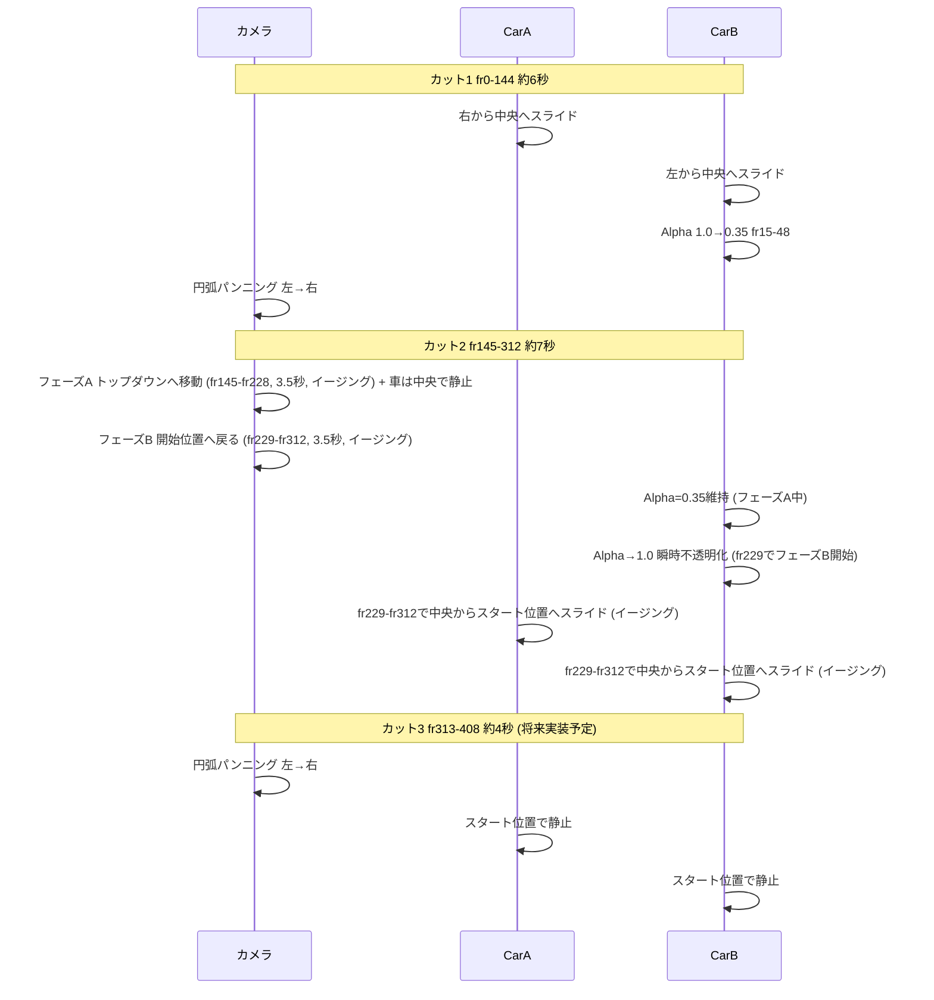

# Short2の仕様.md

## 1. 概要
- カット1の「車が重なっていく部分」だけを抽出した独立動画 → カット1として定義
- カット2を追加し、2つのカットをつなげた連続動画を構成
- YouTube Shorts用の縦長フォーマット（9:16）
- ショート動画v2として、半透明化をキーフレーム直接設定方式を使用

## 2. フォーマット設定
- 解像度: 1080x1920（縦長9:16）
- フレームレート: 24fps
- 総フレーム数: 312フレーム（約13秒）
  - カット1: fr0-144（約6秒）
  - カット2: fr145-312（約7秒）
    - フェーズA: fr145-228（3.5秒）
    - フェーズB: fr229-312（3.5秒）
- 出力ファイル名: `short2_overlap.mp4`

## 3. カット1 (fr0-144, 約6秒) — 既存仕様

### 3-1. 車のアニメーション
- **フレーム0**: 車のスタート位置
  - CarA: X=-1.25, Y=rear_offset_y（向かって右側、手前）
  - CarB: X=1.25, Y=0.0（向かって左側、奥）
- **フレーム48**: 中央集合完了（2秒かけてスライド）
  - CarA: 右から中央へスライド
  - CarB: 左から中央へスライド
- **フレーム48〜144**: 中央位置維持

### 3-2. カメラパンニング
- **円弧運動**: (0,0)をピボットとして円弧上を移動
- **スタート位置**: (-3.0, -6.0, 3.5)（向かって左側の視点）
- **回転量**: 全フレームで-0.85ラジアン（49.4°）程度（144フレーム基準に比例延長）
- **レンズ**: 35mm（ズームイン設定）
- **ターゲット**: (0.0, 0.0, 1.0) を向く

### 3-3. CarBの半透明化
- **方式**: ドライバー式（Principled BSDFのAlphaに数式ドライバーを追加）
- **フレーム15-48**: スムーズに半透明化 (Alpha: 1.0→0.35)
- 車の重なり部分を強調し、奥行き感を演出

### 3-4. カット1終了地点（fr144時点）
- CarA: 中央集合位置 (X≈0, Y=rear_offset_y, Z=grounded_z_a)
- CarB: 中央集合位置 (X≈0, Y=0.0, Z=grounded_z_b)
- カメラ: 円弧パンニング右方向終了位置
- CarB: Alpha=0.35（半透明状態）

---

## 4. カット2 (fr145-312, 約7秒) — 仕様変更

### 4-1. 概要
- カット1のfr144終了地点から連続して開始
- トップダウンビューへカメラ移動 → カメラをカット1開始位置へスムーズに戻す
- **同時に車をスライドさせてカット1のスタート位置まで戻す**
- CarBはフェーズA中は半透明維持、フェーズB開始で瞬時に不透明に戻る
- **カメラの移動にはイージング関数（ease in-out cubic）を適用し、頂点付近で滑らかに動作する**

### 4-2. フェーズ構成

| フェーズ | フレーム範囲 | 秒数 | 内容 |
|----------|-------------|------|------|
| フェーズA | fr145 - fr228 | 3.5秒 (84f) | カメラを x:0, y:0, z:8m まで移動（トップダウンビュー） + 車は中央で静止 |
| フェーズB | fr229 - fr312 | 3.5秒 (84f) | カメラをカット1開始位置 (-3.0, -6.0, 3.5) までスムーズに戻す + CarB不透明化 + 車をスライドして初期位置へ |

### 4-3. フェーズA (fr145-fr228, 3.5秒): トップダウン移動 + 車静止
- カメラ: fr144のカメラ位置から (0, 0, 8) へスムーズに移動（イージング適用）
- **車: 中央集合位置で静止**（2台が重なったまま、フェーズBでスライド開始）
- CarB: Alpha=0.35（半透明状態維持）

### 4-4. フェーズB (fr229-fr312, 3.5秒): カメラ復帰 + 不透明化 + 車スライド
- カメラ: (0, 0, 8) から (-3.0, -6.0, 3.5)（カット1の開始カメラ位置）へスムーズに移動（イージング適用）
- **車: 中央集合位置からカット1開始位置へスライド → fr312で到達**
  - CarA: 中央 → (-1.25, rear_offset_y, grounded_z_a)
  - CarB: 中央 → (1.25, 0.0, grounded_z_b)
- CarB: **fr229で Alpha=1.0 に瞬時に変更**（徐々に戻すのではなく、フェーズB開始と同時に不透明）
  - **重要**: キーフレームの補間モードは `CONSTANT` に設定。fr228(Alpha=0.35)→fr229(Alpha=1.0) の間で滑らかに遷移せず、
    fr228まで Alpha=0.35 が維持されたまま、fr229に到達した瞬間に Alpha=1.0 になる（階段状のステップ変化）。

### 4-4b. Alpha補間モードに関する注意
- **CarBの半透明化→不透明化は「瞬時」に実行する**（gradually変化しない）
- `_add_transparency_keyframe_existing` の `interpolation` パラメータを `'CONSTANT'` に設定することで、
  フレーム境界で値がジャンプし、中間フレームで補間されないようにする
- これにより、fr228までは Alpha=0.35（半透明）が維持され、fr229から突然 Alpha=1.0（完全不透明）になる

### 4-5. カット2終了地点（fr312時点）
- CarA: カット1開始位置 (-1.25, rear_offset_y, grounded_z_a)
- CarB: カット1開始位置 (1.25, 0.0, grounded_z_b)
- カメラ: (-3.0, -6.0, 3.5)（カット1開始カメラ位置）
- CarB: Alpha=1.0（不透明）

---

## 5. カット3 (fr313-408, 約4秒) — 将来実装予定

### 5-1. 概要
- カット2のfr312終了地点から連続して開始
- カメラを左から右へパンニング（カット1と同様の円弧運動）
- 車は静止したまま

### 5-2. 車のアニメーション
- 車はカット1の開始位置を維持（不动）
  - CarA: (-1.25, rear_offset_y, grounded_z_a)
  - CarB: (1.25, 0.0, grounded_z_b)

### 5-3. カメラパンニング
- **円弧運動**: (0,0)をピボットとして円弧上を移動（カット1と同様）
- **スタート位置**: (-3.0, -6.0, 3.5)（カット2終了地点のカメラ位置から接続、スケール適用時の値も同様）
- **回転量**: -0.85ラジアン（49.4°）程度
- **レンズ**: 35mm
- **ターゲット**: (0.0, 0.0, 1.0) を向く

### 5-4. CarBの透明度
- Alpha=1.0（不透明のまま維持）

---

## 6. カメラ構成
- Track To コンストレイントを無効化（直接回転制御）
- キーフレーム間隔: 24フレーム（1秒ごと）
- カメラ位置と回転を毎秒キーフレーム設定
- **カット2フェーズA/Bのカメラ補間にイージング関数（ease in-out cubic）を適用**

## 7. テキストラベルの配置
- **関数**: `create_glowing_text_label_short2()` を使用
- **位置**: ワールド座標で車の真上に中央揃え
- **CarA**: world_max_z + 0.5 の高さ
- **CarB**: world_max_z + 0.7 の高さ（CarAよりやや高く配置）
- **外観**: 発光マテリアル、テキストに厚み（extrude=0.025）

## 8. 全体のフロー図



## 9. フレーム・時間構成まとめ

| カット | フレーム範囲 | 秒数 | カメラ動作 | 車の動作 | CarB透明度 |
|--------|-------------|------|-----------|---------|-----------|
| カット1 | fr0 - fr144 | ~6秒 | 円弧パンニング(左→右) | 中央へスライド後静止 | Alpha 1.0→0.35 |
| カット2A | fr145 - fr228 | **3.5秒** | トップダウンへ移動 (z:8m) [イージング] | 中央集合位置で静止 | Alpha 0.35維持 |
| カット2B | fr229 - fr312 | **3.5秒** | 開始位置へ復帰 [イージング] | 中央からスタート位置へスライド | Alpha→1.0 (fr229で瞬時) |
| カット3 | fr313 - fr408 | ~4秒 | 円弧パンニング(左→右) | 静止 | Alpha 1.0維持 |

## 10. 実行方法
```bash
python run.py short2
```

## 11. 関連ファイル
- [`animation_settings_short2.py`](../animation_settings_short2.py): アニメーション設定（カット1の既存コード + カット2を追加予定）
- [`blend_scene_creator.py`](../blend_scene_creator.py): シーン作成、テキストラベル生成
- [`run.py`](../run.py): エントリポイント
