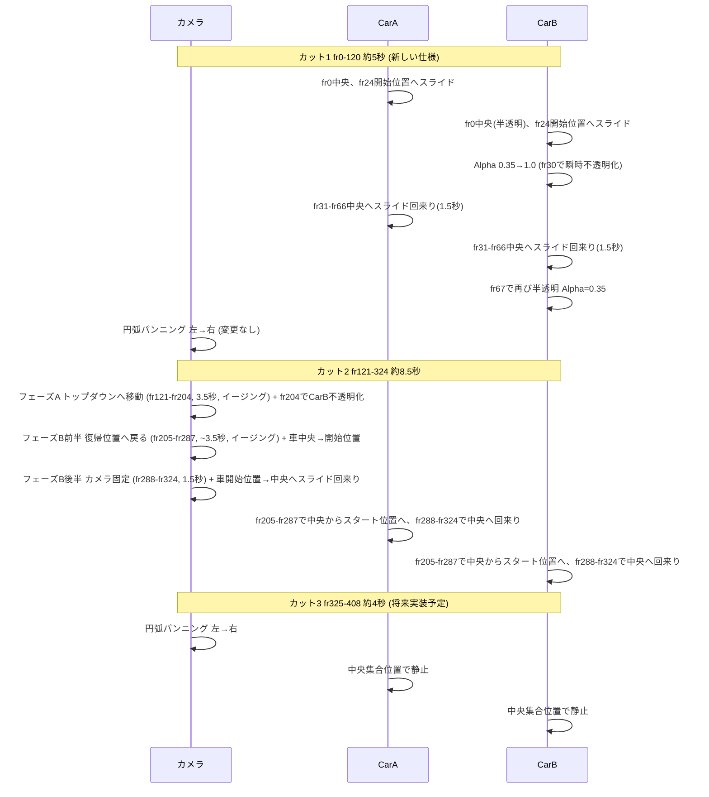

# Short2の仕様.md

## 1. 概要
- カット1の「車が重なっていく部分」だけを抽出した独立動画 → カット1として定義
- カット2を追加し、2つのカットをつなげた連続動画を構成
- YouTube Shorts用の縦長フォーマット（9:16）
- ショート動画v2として、半透明化をキーフレーム直接設定方式を使用

## 2. フォーマット設定
- 解像度: 1080x1920（縦長9:16）
- フレームレート: 24fps
- 総フレーム数: 312フレーム（約13秒）
  - カット1: fr0-144（約6秒）
  - カット2: fr145-312（約7秒）
    - フェーズA: fr145-228（3.5秒）
    - フェーズB: fr229-312（3.5秒）
- 出力ファイル名: `short2_overlap.mp4`

## 3. カット1 (fr0-120, 約5秒) — 新しい仕様

### 3-1. 車のアニメーション
- **フレーム0**: 2台の車が中央で重なり
  - CarA: X≈0, Y=rear_offset_y（中央集合位置）
  - CarB: X≈0, Y=0.0（中央集合位置、半透明 Alpha=0.35）
- **フレーム1-24 (1秒)**: 各自の開始位置へスライド
  - CarA: 中央 → (-1.25, rear_offset_y)
  - CarB: 中央 → (1.25, 0.0)
- **フレーム30**: CarBが不透明化 (Alpha: 0.35→1.0, CONSTANT補間で瞬時切り替え)
- **フレーム31-66 (1.5秒)**: 再び中央へスライドして重なり
  - CarA: (-1.25, rear_offset_y) → 中央集合位置
  - CarB: (1.25, 0.0) → 中央集合位置
- **フレーム67〜120**: 中央位置維持 (carBは再度半透明 Alpha=0.35)

### 3-2. カメラパンニング
- **円弧運動**: (0,0)をピボットとして円弧上を移動（変更なし）
- **スタート位置**: (-3.0, -6.0, 3.5)（向かって左側の視点）
- **回転量**: 全フレームで-1.7ラジアン（約98°）程度（144フレーム基準に比例延長）
- **レンズ**: 35mm（ズームイン設定）
- **ターゲット**: (0.0, 0.0, 1.0) を向く

### 3-3. CarBの半透明化（3段階透明度仕様）
- **方式**: Mix Shader Facキーフレーム式（CONSTANT補間で瞬時切り替え）
- **フレーム0-29**: Alpha=0.35 (半透明) — 車が中央で重なる際、carBは半透明で重なりを表現
- **フレーム30-66**: Alpha=1.0 (完全不透明) — fr30で瞬時に不透明化（スライドアウト後）
- **フレーム67-203**: Alpha=0.35 (半透明) — スライドイン完了後、再び半透明に
- **フレーム204-end_frame**: Alpha=1.0 (不透明) — フェーズA終了で最終不透明化

### 3-4. カット1終了地点（fr120時点）
- CarA: 中央集合位置 (X≈0, Y=rear_offset_y, Z=grounded_z_a)
- CarB: 中央集合位置 (X≈0, Y=0.0, Z=grounded_z_b)
- カメラ: 円弧パンニング右方向終了位置
- CarB: Alpha=0.35（半透明状態 - fr67で再び半透明になっている）

---

## 4. カット2 (fr121-324, 約8.5秒) — 仕様変更

### 4-1. 概要
- カット1のfr120終了地点から連続して開始
- トップダウンビューへカメラ移動 → カメラをカット1開始位置へスムーズに戻す
- 車をスライドさせてカット1のスタート位置まで戻し、その後中央へスライド回来り
- CarBはフェーズA終了時（fr204）に不透明化
- **カメラの移動にはイージング関数（ease in-out cubic）を適用し、頂点付近で滑らかに動作する**

### 4-2. フェーズ構成

| フェーズ | フレーム範囲 | 秒数 | 内容 |
|----------|-------------|------|------|
| フェーズA | fr121 - fr204 | 3.5秒 (84f) | カメラを x:0, y:0, z:8m まで移動（トップダウンビュー） + **fr204でCarB不透明化** |
| フェーズB前半 | fr205 - fr287 | ~3.5秒 (83f) | カメラを復帰位置へスムーズに戻す + 車を中央→開始位置へスライド |
| フェーズB後半 | fr288 - fr324 | **1.5秒 (37f)** | カメラ固定 + 車を開始位置→中央へスライド回来り |

### 4-3. フェーズA (fr121-fr204, 3.5秒): トップダウン移動 + CarB不透明化
- カメラ: fr120のカメラ位置から (0, 0, 8) へスムーズに移動（イージング適用）
- **車: 中央集合位置で静止**（2台が重なったまま、フェーズBでスライド開始）
- CarB: Alpha=0.35 → fr204で Alpha=1.0（不透明化）

### 4-4. フェーズB前半 (fr205-fr287, ~3.5秒): カメラ復帰 + 車スライド
- カメラ: (0, 0, 8) から (-3.0, -6.0, 3.5)（カット1の開始カメラ位置）へスムーズに移動（イージング適用）
- **車: 中央集合位置からカット1開始位置へスライド**
  - CarA: 中央 → (-1.25, rear_offset_y, grounded_z_a)
  - CarB: 中央 → (1.25, 0.0, grounded_z_b)

### 4-5. フェーズB後半 (fr288-fr324, 1.5秒): カメラ固定 + 車スライド回来り
- カメラ: 復帰位置 (-3.0, -6.0, 3.5) で**固定**
- **車: 開始位置から中央集合位置へスライド回来り (イージング適用)**
  - CarA: (-1.25, rear_offset_y) → 中央集合位置
  - CarB: (1.25, 0.0) → 中央集合位置

### 4-6. Alpha補間モードに関する注意
- **CarBの半透明化→不透明化はフェーズA終了時（fr204）に完了する**
- `_setup_short2_carb_transparency` の `interpolation` パラメータを `'CONSTANT'` に設定することで、
  フレーム境界で値がジャンプし、中間フレームで補間されないようにする

### 4-7. カット2終了地点（fr324時点）
- CarA: **中央集合位置** (X≈0, Y=rear_offset_y, Z=grounded_z_a)
- CarB: **中央集合位置** (X≈0, Y=0.0, Z=grounded_z_b)
- カメラ: (-3.0, -6.0, 3.5)（カット1開始カメラ位置）
- CarB: Alpha=1.0（不透明）

---

## 5. カット3 (fr313-408, 約4秒) — 将来実装予定

### 5-1. 概要
- カット2のfr312終了地点から連続して開始
- カメラを左から右へパンニング（カット1と同様の円弧運動）
- 車は静止したまま

### 5-2. 車のアニメーション
- 車はカット1の開始位置を維持（不动）
  - CarA: (-1.25, rear_offset_y, grounded_z_a)
  - CarB: (1.25, 0.0, grounded_z_b)

### 5-3. カメラパンニング
- **円弧運動**: (0,0)をピボットとして円弧上を移動（カット1と同様）
- **スタート位置**: (-3.0, -6.0, 3.5)（カット2終了地点のカメラ位置から接続、スケール適用時の値も同様）
- **回転量**: -1.7ラジアン（約98°）程度
- **レンズ**: 35mm
- **ターゲット**: (0.0, 0.0, 1.0) を向く

### 5-4. CarBの透明度
- Alpha=1.0（不透明のまま維持）

---

## 6. カメラ構成
- Track To コンストレイントを無効化（直接回転制御）
- キーフレーム間隔: 24フレーム（1秒ごと）
- カメラ位置と回転を毎秒キーフレーム設定
- **カット2フェーズA/Bのカメラ補間にイージング関数（ease in-out cubic）を適用**

## 7. テキストラベルの配置
- **関数**: `create_glowing_text_label_short2()` を使用
- **位置**: ワールド座標で車の真上に中央揃え
- **CarA**: world_max_z + 0.5 の高さ
- **CarB**: world_max_z + 0.7 の高さ（CarAよりやや高く配置）
- **外観**: 発光マテリアル、テキストに厚み（extrude=0.025）

## 8. 全体のフロー図


```mermaid
sequenceDiagram
    participant カメラ
    participant CarA
    participant CarB

    Note over カメラ,CarB: カット1 fr0-120 約5秒 (新しい仕様)
    CarA->>CarA: fr0中央、fr24開始位置へスライド
    CarB->>CarB: fr0中央(半透明)、fr24開始位置へスライド
    CarB->>CarB: Alpha 0.35→1.0 (fr30で瞬時不透明化)
    CarA->>CarA: fr31-fr66中央へスライド回来り(1.5秒)
    CarB->>CarB: fr31-fr66中央へスライド回来り(1.5秒)
    CarB->>CarB: fr67で再び半透明 Alpha=0.35
    カメラ->>カメラ: 円弧パンニング 左→右 (変更なし)

    Note over カメラ,CarB: カット2 fr121-324 約8.5秒
    カメラ->>カメラ: フェーズA トップダウンへ移動 (fr121-fr204, 3.5秒, イージング) + fr204でCarB不透明化
    カメラ->>カメラ: フェーズB前半 復帰位置へ戻る (fr205-fr287, ~3.5秒, イージング) + 車中央→開始位置
    カメラ->>カメラ: フェーズB後半 カメラ固定 (fr288-fr324, 1.5秒) + 車開始位置→中央へスライド回来り
    CarA->>CarA: fr205-fr287で中央からスタート位置へ、fr288-fr324で中央へ回来り
    CarB->>CarB: fr205-fr287で中央からスタート位置へ、fr288-fr324で中央へ回来り

    Note over カメラ,CarB: カット3 fr325-408 約4秒 (将来実装予定)
    カメラ->>カメラ: 円弧パンニング 左→右
    CarA->>CarA: 中央集合位置で静止
    CarB->>CarB: 中央集合位置で静止
```

## 9. フレーム・時間構成まとめ

| カット | フレーム範囲 | 秒数 | カメラ動作 | 車の動作 | CarB透明度 |
|--------|-------------|------|-----------|---------|-----------|
| カット1 | fr0 - fr120 | **~5秒** | 円弧パンニング(左→右) | fr0中央重なり→fr24開始位置→fr31-66中央回来り→fr67半透明 | Alpha 0.35→1.0(fr30)→0.35(fr67) |
| カット2A | fr121 - fr204 | **3.5秒** | トップダウンへ移動 (z:8m) [イージング] | 中央集合位置で静止 | Alpha 0.35→**1.0**(fr204) |
| カット2B前半 | fr205 - fr287 | **~3.5秒** | 開始位置へ復帰 [イージング] | 中央→開始位置へスライド | Alpha 1.0維持 |
| カット2B後半 | fr288 - fr324 | **1.5秒** | カメラ固定 | 開始位置→中央へスライド回来り | Alpha 1.0維持 |
| カット3 | fr325 - fr408 | ~4秒 | 円弧パンニング(左→右) | 静止 | Alpha 1.0維持 |

## 10. 実行方法
```bash
python run.py short2
```

## 11. 関連ファイル
- [`animation_settings_short2.py`](../animation_settings_short2.py): アニメーション設定（カット1の既存コード + カット2を追加予定）
- [`blend_scene_creator.py`](../blend_scene_creator.py): シーン作成、テキストラベル生成
- [`run.py`](../run.py): エントリポイント
