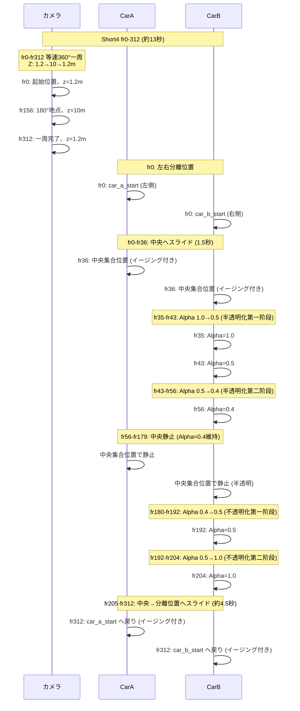

# Short4の仕様.md

## 1. 概要
- **全新的な車のアニメーションパターン**を採用したバージョン
- **カメラ: fr0-fr{total_frames}で円弧上を等速で360°一周（12-14秒ランダム±1秒）、Z高さはサイン波変化 (1.2→10→1.2m)**
- **車: 左右分離位置→中央スライド→半透明化→不透明化→分離位置へスライド の一連フロー**
- YouTube Shorts用の縦長フォーマット（9:16）

## 2. フォーマット設定
- 解像度: 1080x1920（縦長9:16）
- フレームレート: 24fps
- 総フレーム数: 288-336フレーム（約12-14秒、±1秒ランダム化）
- カメラ回転完了: fr{total_frames}（12-14秒、一周完了＝動画終了）
- 出力ファイル名: `short4_overlap.mp4`

## 3. 車のアニメーション — 新しいパターン

### 3-1. スライドインフェーズ (fr0-fr36, ~1.5秒)
- **フレーム0**: 2台の車が左右に離れた開始位置に配置
  - CarA: (-1.25, rear_offset_y)
  - CarB: (1.25, 0.0)
- **フレーム1-36 (1.5秒)**: 中央集合位置へスライド（イージング付き）
  - CarA: 開始位置 → 中央集合位置 (0 - offset_a[0], rear_offset_y)
  - CarB: 開始位置 → 中央集合位置 (0 - offset_b[0], 0.0)
  - イージング関数: `_ease_in_out_cubic`（滑らかな加減速）

### 3-2. 半透明化フェーズ (fr35-fr56, ~1秒)
- **fr35-fr43 (第一阶段, 約0.33秒)**: Alpha 1.0→0.5
- **fr43-fr56 (第二阶段, 約0.43秒)**: Alpha 0.5→0.4
- 透明度対象車: CarB（固定）

### 3-3. 半透明静止フェーズ (fr56-fr179, ~5.13秒)
- CarA, CarB: 中央集合位置で静止（重なったまま）
- 透明度対象車: Alpha=0.4 で半透明維持

### 3-4. 不透明化フェーズ (fr180-fr204, ~1秒)
- **fr180-fr192 (第一阶段, 約0.33秒)**: Alpha 0.4→0.5
- **fr192-fr204 (第二阶段, 約0.33秒)**: Alpha 0.5→1.0
- fr204で完全に不透明化

### 3-5. スライドアウトフェーズ (fr205-fr312, ~4.5秒)
- CarA, CarB: 中央集合位置から左右に離れた開始位置へゆっくりスライド（イージング付き）
- 透明度対象車: Alpha=1.0 で不透明維持
- fr312で両車が分離位置に到達（終了状態）

---

## 4. カメラ — 円弧等速360°一周（Zサイン波、13秒完了）

### 4-1. 概要
- **fr0-fr312**: 円弧上を等速で360°一周（約13秒）、Z高さはサイン波変化 (1.2→10→1.2m)
- 起始位置から負方向（時計回り）に2πラジアン回転

### 4-2. カメラ動作の詳細
- **円弧パラメータ**:
  - 中心: (0, 0)
  - 半径: arc_radius = sqrt(cam_start_x^2 + cam_start_y^2)（スケール適用後）
  - Z高さ: サイン波で変化 — fr0: z=1.2m → fr156(180°): z=10m → fr312(360°): z=1.2m
- **起始角度**: start_angle = atan2(cam_start_x, cam_start_y)
- **総回転量**: -360°（=-2πラジアン、負方向=時計回り）
- **補間方式**: LINEAR（等速移動、イージングなし）
- **キーフレーム間隔**: 1フレームごと（滑らかな円弧のため）
- **回転完了フレーム**: fr312（24fps × 13秒 = 312フレーム）

### 4-3. フレームごとのカメラ角度計算
```
total_frames = 312  # 13秒で完了
progress = frame / total_frames  (fr0=0, fr312=1)
angle = start_angle - (2 * π * progress)
cam_x = arc_radius * sin(angle)
cam_y = arc_radius * cos(angle)
cam_z = z_min + (z_max - z_min) * sin(progress * π)

※z_min=1.2, z_max=10.0
※fr0: sin(0)=0 → z=1.2m
※fr156: sin(π/2)=1 → z=10.0m (最大高さ、180°地点)
※fr312: sin(π)=0 → z=1.2m (元に戻る)
※キーフレーム間隔: 1フレームごと（滑らかな円弧のため）
```

---

## 5. CarBの半透明化 — 新しい4段階透明度パターン

| フレーム範囲 | Alpha値 | 説明 |
|------------|---------|------|
| fr0-fr34 | 1.0 | 不透明（スライドイン中） |
| fr35-fr43 | 1.0→0.5 | 半透明化第一阶段: 漸減 (約0.27秒=8フレーム) |
| fr43-fr56 | 0.5→0.4 | 半透明化第二阶段: 完全半透明化 (約0.43秒=13フレーム) |
| fr56-fr179 | 0.4 | 半透明維持（中央静止） |
| fr180-fr192 | 0.4→0.5 | 不透明化第一阶段: 漸増 (約0.33秒=8フレーム) |
| fr192-fr204 | 0.5→1.0 | 不透明化第二阶段: 完全不透明化 (約0.33秒=8フレーム) |
| fr204-fr312 | 1.0 | 不透明維持（分離位置へスライド） |

### 透明度設定の詳細
- 半透明化第一阶段: `_setup_transparency_keyframe_animation(target_car, 35, 43, 1.0, 0.5, step_frames=4)`
- 半透明化第二阶段: `_setup_transparency_keyframe_animation(target_car, 43, 56, 0.5, 0.4, step_frames=4)`
- 不透明化第一阶段: `_setup_transparency_keyframe_animation(target_car, 180, 192, 0.4, 0.5, step_frames=4)`
- 不透明化第二阶段: `_setup_transparency_keyframe_animation(target_car, 192, 204, 0.5, 1.0, step_frames=4)`
- 固定: fr56, fr179 で Alpha=0.4 / fr204, fr312 で Alpha=1.0

---

## 6. 全体のフロー図



## 7. フレーム構成まとめ

| 区間 | カメラ動作 | 車の動作 | CarB透明度 |
|------|-----------|---------|-----------|
| fr0-fr36 | 360°一周の進行中（約140°） | fr0: 分離→fr36: 中央スライド完了 | 1.0維持 |
| fr37-fr34 | 360°一周の進行中（約12°） | 中央で静止 | 1.0維持 |
| fr35-fr43 | 360°一周の進行中（約35°） | 中央で静止 | 1.0→0.5 (半透明化第一阶段) |
| fr44-fr56 | 360°一周の進行中（約24°） | 中央で静止 | 0.5→0.4 (半透明化第二阶段) |
| fr57-fr179 | 360°一周の進行中（約462°相当、約47°） | 中央で静止 | 0.4維持 |
| fr180-fr192 | 360°一周の進行中（約48°） | 中央で静止 | 0.4→0.5 (不透明化第一阶段) |
| fr193-fr204 | 360°一周の進行中（約45°） | 中央で静止 | 0.5→1.0 (不透明化第二阶段) |
| fr205-fr312 | 360°一周の完了（約239°） | 中央→分離位置へスライド（約4.5秒） | 1.0維持 |

## 8. ファイル構成

| ファイル | 説明 |
|----------|------|
| [`animation_settings_short4.py`](animation_settings_short4.py) | メインオーケストレーション (total_frames=312、カメラ一周fr312完了) |
| [`short4_cuts.py`](short4_cuts.py) | カット位置アニメーションモジュール |
|  | `setup_arc_full_circle()` - fr0-fr312で等速360°一周 + 新車アニメーション |

## 9. 実行方法
```bash
python run.py short4
```

## 10. Short2との違い

| 項目 | Short2 | Short4 |
|------|--------|--------|
| カメラ動作 | カット1: 円弧パンニング、カット2A: トップダウン、カット2B: 復帰 | fr0-fr312全体で等速360°一周（Zサイン波） |
| 車の開始状態 | fr0: 中央で重なり | fr0: 左右分離位置 |
| 車のスライド方向 | 中央→分離→中央回来り | 分離→中央→静止→不透明化→分離位置へスライド |
| 透明度パターン | 3段階 (fr30=1.0, fr67=0.35, fr204=1.0) | 4段階 (半透明化2段階 + 不透明化2段階, Alpha=0.4) |
| 車の最終状態 | 中央集合位置（不透明） | 分離位置（不透明） |
| カメラZ高さ | 一定 | サイン波 (1.2m→10m→1.2m) |
