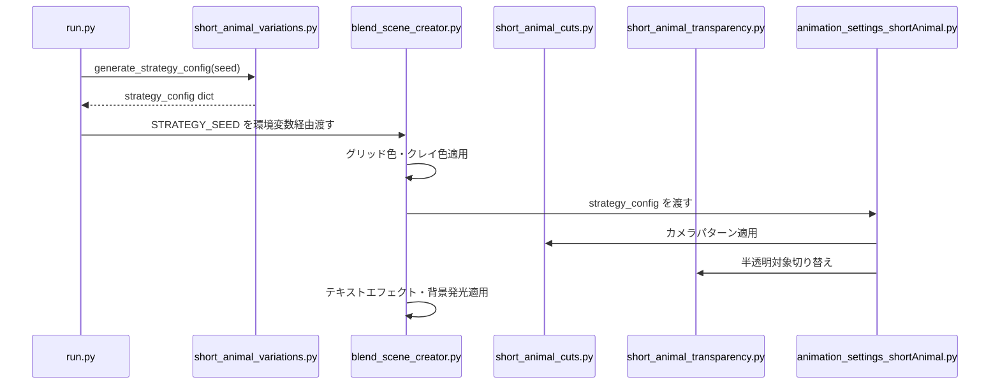

# 動物ショート動画 バリエーションシステム 設計書

## 1. 概要

Short2に導入したランダム化バリエーションシステムを、動物比較ショート動画 (shortAnimal) にも適用する。
同じ動物ペアを指定しても、実行するたびに異なる見た目・動きの動画が生成されるようにする。

### 目標
- Short2と同様にハードコーディング変更なしでバリエーション生成
- 動物特有の演出（円軌道カメラ、半透明化同期など）を維持しつつ変動
- cars_config.json / animals_config.json は変更しない

## 2. システム全体アーキテクチャ

```mermaid
flowchart NR
    A[run.py] -->|STRATEGY_SEED| B[short_animal_variations.py]
    B -->|strategy_config dict| C[blend_scene_creator.py]
    B -->|strategy_config dict| D[short_animal_cuts.py]
    B -->|strategy_config dict| E[short_animal_transparency.py]
    B -->|strategy_config dict| F[animation_settings_shortAnimal.py]
    
    style B fill:#2ecc71,color:#fff
    style C fill:#e74c3c,color:#fff
```

## 3. モジュール構成

### 3.1 新規: `short_animal_variations.py`

Short2の `short2_variations.py` をベースに、動物ショート用にカスタマイズする。

#### 3.1.1 色パレットプリセット

Short2と同じプリセットを流用する。

```python
# Short2と同じプリセットをimportで流用
from short2_variations import (
    GRID_COLOR_PRESETS, CLAY_COLOR_PRESETS, BACKGROUND_GLOW_PRESETS,
    select_distinct_clay_colors, EASING_FUNCTIONS, get_easing_function,
    SLIDE_SPEED_MULTIPLIERS, LABEL_APPEAR_EFFECTS, GRID_PULSE_ENABLED
)
```

**ルール**: animalA と animalB は必ず異なるクレイ色を選択（RGB距離0.35以上）

#### 3.1.2 カメラパターンプリセット（動物用カスタム版）

動物ショートは「固定位置カメラ + 円軌道」構造なので、Short2の円弧パンとは異なる。

```python
# カット1-2のカメラY固定値を ±1.5m の範囲で変動
CAMERA_Y_OFFSET_PRESETS = [
    {"name": "standard",   "y_offset": -11.0},  # 標準位置
    {"name": "closer",     "y_offset": -9.5},    # カメラを前に出す
    {"name": "further",    "y_offset": -12.0},   # カメラを後ろに引く
]

# カット1のZ始点/終点位置を変動
CAMERA_Z_PRESETS = [
    {"name": "standard",    "z_start": 0.5, "z_end": 7.0},
    {"name": "lower_start", "z_start": 0.3, "z_end": 6.0},
    {"name": "higher_end",  "z_start": 0.7, "z_end": 8.0},
]

# カット3の円軌道パラメータを変動
ORBIT_VARIATIONS = [
    {"name": "standard",    "radius": 11.0, "turns": 1.1},
    {"name": "wider",       "radius": 12.5, "turns": 1.1},
    {"name": "tighter",     "radius": 9.5,  "turns": 1.2},
    {"name": "slower",      "radius": 11.0, "turns": 1.0},
]

# カット3の開始角度を変動（切断接続位置をズラす）
ORBIT_START_ANGLE_VARIATIONS = [
    {"name": "south",       "angle_offset": 0.0},      # 南側から开始 (標準)
    {"name": "south_west",  "angle_offset": -0.3},     # 南西寄り
    {"name": "south_east",  "angle_offset": 0.3},      # 南東寄り
]
```

#### 3.1.3 総フレーム数変動

```python
BASE_TOTAL_FRAMES_ANIMAL = 936  # 約39秒 (標準)
TOTAL_FRAME_DURATION_MULTIPLIERS = [0.85, 0.9, 1.0, 1.1]  # ±15% の動画長さ変動
```

#### 3.1.4 メイン選択関数

```python
def generate_strategy_config(seed=None):
    """ランダムに各プリセットを1つずつ選び、設定辞書を返す"""
    rng = random.Random(seed)
    
    # ルール: animalA と animalB は異なるクレイ色
    clay_a, clay_b = select_distinct_clay_colors(rng, CLAY_COLOR_PRESETS, min_distance=0.35)
    
    config = {
        # 色設定
        "grid_color": rng.choice(GRID_COLOR_PRESETS),
        "clay_color_a": clay_a,
        "clay_color_b": clay_b,
        "bg_glow": rng.choice(BACKGROUND_GLOW_PRESETS),
        
        # カメラ設定
        "camera_y_offset": rng.choice(CAMERA_Y_OFFSET_PRESETS),
        "camera_z": rng.choice(CAMERA_Z_PRESETS),
        "orbit_variation": rng.choice(ORBIT_VARIATIONS),
        "orbit_start_angle": rng.choice(ORBIT_START_ANGLE_VARIATIONS),
        
        # テンポ設定
        "easing_function": rng.choice(list(EASING_FUNCTIONS.keys())),
        "slide_speed": rng.choice(SLIDE_SPEED_MULTIPLIERS),
        "total_frames_multiplier": rng.choice(TOTAL_FRAME_DURATION_MULTIPLIERS),
        
        # 演出設定
        "label_effect": rng.choice(LABEL_APPEAR_EFFECTS),
        "grid_pulse": rng.choice(GRID_PULSE_ENABLED),
    }
    
    # 総フレーム数を計算して追加（24の倍数に丸める）
    multiplier = config["total_frames_multiplier"]
    total_frames = round(BASE_TOTAL_FRAMES_ANIMAL * multiplier)
    total_frames = round(total_frames / 24) * 24
    if total_frames < 600:  # 最短25秒以下を防止
        total_frames = 600
    config["total_frames"] = total_frames
    
    return config
```

### 3.2 既存モジュールへの適用箇所

#### 3.2.1 `run.py` への変更

**重要な発見**: run.py の STRATEGY_SEED 設定は currently short2 のみに適用されている。

現在のコード ([`run.py:242-246`](run.py:242)):
```python
if cut_number == "short2":
    if seed is None:
        seed = random.randint(1, 999999)
    env["STRATEGY_SEED"] = str(seed)
    print(f"Short2 バリエーションシード: {seed}")
```

**変更戦略**: shortAnimalにもSTRATEGY_SEEDを適用するよう条件を追加する。

```python
# 変更後
if cut_number in ("short2", "shortAnimal"):
    if seed is None:
        seed = random.randint(1, 999999)
    env["STRATEGY_SEED"] = str(seed)
    mode_name = "Short2" if cut_number == "short2" else "ShortAnimal"
    print(f"{mode_name} バリエーションシード: {seed}")
```

#### 3.2.2 `blend_scene_creator.py` への変更

**変更点**: shortAnimal モードでバリエーション設定を読み込み、色を適用する。

| 関数 | 変更内容 |
|------|---------|
| `main()` のshortAnimal分岐 | `load_config_from_env()` を呼び出して SHORT_ANIMAL_CONFIG を取得 |
| `create_grid_floor()` 後 | グリッド色の即時適用（Short2と同様） |
| `setup_car()` 後 | クレイ色の変更を动物のインポート後に適用 |
| `create_glowing_text_label()` 後 | テキスト出現エフェクト + 背景発光の適用 |

**実装パターン**:
```python
# blend_scene_creator.py の short2分岐と同じ場所（L1415付近）に shortAnimal用のブロックを追加
if CUT_NUMBER == "shortAnimal":
    try:
        from short2_apply_variations import (
            load_config_from_env, apply_grid_color, 
            apply_clay_colors_per_car, apply_label_appear_effect,
            apply_background_glow, apply_grid_pulse_effect
        )
        SHORT_ANIMAL_CONFIG = load_config_from_env()
        if SHORT_ANIMAL_CONFIG and "grid_color" in SHORT_ANIMAL_CONFIG:
            apply_grid_color(SHORT_ANIMAL_CONFIG["grid_color"])
    except Exception as e:
        print(f"  バリエーション設定エラー: {e}")
```

**動物インポート後のクレイ色適用箇所** ([`blend_scene_creator.py:1489`](blend_scene_creator.py:1489) 付近):
```python
# shortAnimalモード: クレイ色の変更を动物のインポート後に適用
if CUT_NUMBER == "shortAnimal" and SHORT_ANIMAL_CONFIG and "clay_color_a" in SHORT_ANIMAL_CONFIG:
    apply_clay_colors_per_car(SHORT_ANIMAL_CONFIG["clay_color_a"], SHORT_ANIMAL_CONFIG["clay_color_b"])
```

**テキストラベル後のエフェクト適用箇所** ([`blend_scene_creator.py:1729`](blend_scene_creator.py:1729) 付近):
```python
# shortAnimalモード: テキストエフェクト + 背景発光をテキストラベル作成後に適用
if CUT_NUMBER == "shortAnimal" and SHORT_ANIMAL_CONFIG:
    if "label_effect" in SHORT_ANIMAL_CONFIG:
        text_objects = [obj for obj in bpy.data.objects if obj.type == 'FONT']
        if text_objects:
            apply_label_appear_effect(text_objects, SHORT_ANIMAL_CONFIG["label_effect"])
    if "bg_glow" in SHORT_ANIMAL_CONFIG:
        apply_background_glow(SHORT_ANIMAL_CONFIG["bg_glow"])
    if "grid_pulse" in SHORT_ANIMAL_CONFIG and SHORT_ANIMAL_CONFIG["grid_pulse"]:
        apply_grid_pulse_effect()
```

#### 3.2.3 `short_animal_cuts.py` への変更

**変更点**: カメラ位置・円軌道パラメータを strategy_config から読み取る。

| 関数 | 変更内容 |
|------|---------|
| `setup_cut1_transparency_start()` | Yオフセット、Z始点/終点を config から取得 |
| `setup_cut2_separation()` | Y固定値を config から取得 |
| `setup_cut3_orbit()` | 軌道半径、回転数、開始角度を config から取得 |

**シグネチャ変更例**:
```python
def setup_cut1_transparency_start(camera, car_a, car_b, center_pos_a, center_pos_b, 
                                   separated_pos_a, separated_pos_b, cam_fixed, 
                                   strategy_config=None):
    # YオフセットとZ値を取得（None時はデフォルト値）
    if strategy_config:
        y_offset = strategy_config.get("camera_y_offset", {}).get("y_offset", -11.0)
        z_start = strategy_config.get("camera_z", {}).get("z_start", 0.5)
        z_end = strategy_config.get("camera_z", {}).get("z_end", 7.0)
    else:
        y_offset = -11.0
        z_start = 0.5
        z_end = 7.0
    
    # cam_fixed の Y座標を y_offset に変更して使用
    cam_start = (cam_fixed[0], y_offset, z_start)
    cam_middle = (cam_fixed[0], y_offset, (z_start + z_end) / 2)
    cam_end = (cam_fixed[0], y_offset, z_end)
```

**setup_cut3_orbit の変更**:
```python
def setup_cut3_orbit(camera, car_a, car_b, separated_pos_a, separated_pos_b, cam_height, 
                      strategy_config=None):
    # 軌道パラメータを取得（None時はデフォルト値）
    if strategy_config:
        orbit_var = strategy_config.get("orbit_variation", {})
        ORBIT_RADIUS = orbit_var.get("radius", 11.0)
        turns = orbit_var.get("turns", 1.1)
        
        angle_offset = strategy_config.get("orbit_start_angle", {}).get("angle_offset", 0.0)
    else:
        ORBIT_RADIUS = 11.0
        turns = 1.1
        angle_offset = 0.0
    
    # 開始角度を調整
    orbit_start_angle = math.atan2(-11.0, 1.0) + angle_offset
```

#### 3.2.4 `short_animal_transparency.py` への変更

**変更点**: 半透明化対象を carB固定 → config の transparency_target に従う。

現在の状態: CarB 固定で半透明化。

**変更戦略**: 全高比較ルールを Short2 と同じように適用する。半透明対象の判定は `blend_scene_creator.py` で行い、config に注入する。

```python
# blend_scene_creator.py の shortAnimal分岐に追加
if SHORT_ANIMAL_CONFIG:
    height_a = CARS.get("carA", {}).get("dimensions_mm", {}).get("height", 0)
    height_b = CARS.get("carB", {}).get("dimensions_mm", {}).get("height", 0)
    transparency_target = "carB" if height_b > height_a else "carA"
    SHORT_ANIMAL_CONFIG["transparency_target"] = transparency_target
```

transparency.py の変更は最小限にし、呼び出し側で対象オブジェクトを切り替える方式を採用する。

#### 3.2.5 `animation_settings_shortAnimal.py` への変更

**変更点**: strategy_config を受け取り、各カット設定関数に渡す。

```python
def setup_shortAnimal_animations(scene, camera, imported_cars, rear_offset_y, 
                                  grounded_z_positions, car_dimensions=None, 
                                  total_frames=936, strategy_config=None):
    # total_frames を config から取得
    if strategy_config and "total_frames" in strategy_config:
        total_frames = strategy_config["total_frames"]
    
    # カット1-3にstrategy_configを渡す
    setup_cut1_transparency_start(..., strategy_config=strategy_config)
    setup_cut2_separation(..., strategy_config=strategy_config)
    setup_cut3_orbit(..., strategy_config=strategy_config)
```

**呼び出し側の修正** ([`blend_scene_creator.py:1620`](blend_scene_creator.py:1620) 付近):
```python
setup_shortAnimal_animations(scene, camera, imported_cars, rear_offset_y, 
                             grounded_z_positions, car_dimensions=animal_dimensions, 
                             total_frames=SHORT_ANIMAL_TOTAL_FRAMES,
                             strategy_config=SHORT_ANIMAL_CONFIG)
```

### 3.3 データフロー図



## 4. Short2との差異まとめ

| 項目 | Short2 | ShortAnimal | 備考 |
|------|--------|-------------|------|
| 総フレーム数 | 624 (約26秒) | 936 (約39秒) | 动物は円軌道が長い |
| カメラパターン | 円弧パン + トップダウン | 固定位置 + 円軌道 | 动物特有の構造 |
| 軌道半径 | N/A | 11m → 変動可能 | ±2.5m の範囲でランダム化 |
| 回転数 | N/A | 1.1周 → 変動可能 | 1.0-1.2周の範囲 |
| カット構成 | カット1(重叠), カット2(トップダウン) | カット1(半透明), カット2(分离), カット3(円軌道) | 动物は3カット |
| 色プリセット | 共用 | 共用 | Short2のプリセットをimportで流用 |
| イージング関数 | 4種類 | 4種類 (スライドに適用) | 共用 |
| テキストエフェクト | 3種類 | 3種類 | 共用 |
| 半透明対象 | 全高比較で動的判定 | 全高比較で動的判定 | 同じルールを適用 |

## 5. 環境変数定義

| 環境変数 | 型 | 説明 |
|---------|-----|------|
| `STRATEGY_SEED` | int (optional) | ランダムシード。未指定時は自動生成 |

Short2と同じ環境変数を共用する。

## 6. 再現性保証

- `STRATEGY_SEED` を記録することで、過去の動画を完全再現可能
- 動画ファイル名に `_s{seed}` サフィックスを付けることで特定バージョンを追跡可能

## 7. 実装順序

| 順 | タスク | 影響範囲 | ファイル |
|---|--------|---------|---------|
| 1 | `short_animal_variations.py` 新規作成 | 新規ファイル | - |
| 2 | `run.py` に shortAnimal の seed 対応追加 | STRATEGY_SEED 設定条件 | run.py |
| 3 | `blend_scene_creator.py` で色適用をshortAnimalに拡張 | main() 内の分岐 | blend_scene_creator.py |
| 4 | `animation_settings_shortAnimal.py` でstrategy_config受取 | メイン関数のシグネチャ | animation_settings_shortAnimal.py |
| 5 | `short_animal_cuts.py` でカメラ変動適用 | カット1-3の関数 | short_animal_cuts.py |
| 6 | `short_animal_transparency.py` は対象切り替えを呼び出し側で対応 | 特に変更なし | - |
| 7 | テスト実行 | 全ファイル | - |

## 8. 注意事項

- animals_config.json は変更しない（ルール遵守）
- Short2のバリエーションモジュールと設定プリセットを共通利用する箇所は import で流用
- コアロジックの破壊的変更を避ける。strategy_config が未渡しの場合は既存動作にフォールバック
- Blender 5.2 の API 互換性を維持
- 动物ショートは HumanFigure も半透明化対象なので、transparency_target の切り替え時に Human も同期する必要がある
- **run.py では currently STRATEGY_SEED は short2 のみに適用** → shortAnimal にも対応が必要
