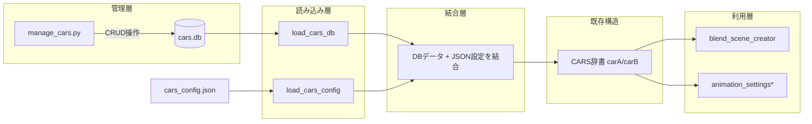

# SQLite車種データベース化設計

## 概要

`cars.csv` から `cars.db` (SQLite) へ車種データを移行し、CLI管理ツールで検索・追加・修正・削除を容易にする。

---

## 1. 移行後のファイル構成

```
blender-vs-code/
├── cars.db                  # SQLiteデータベース (新規)
├── manage_cars.py           # CLI車種管理ツール (新規)
├── cars.csv                 # バックアップ用 (既存、読み取り専用化)
├── cars_config.json         # 変更なし (id参照のみ)
├── blend_scene_creator.py   # CSV読み込み → DB読み込みに変更
└── ...
```

---

## 2. データベーススキーマ設計

### 2.1 cars テーブル

| カラム名 | 型 | 制約 | 説明 |
|---------|-----|------|------|
| id | INTEGER | PRIMARY KEY AUTOINCREMENT | 一意の識別子 (自動採番) |
| name | TEXT | NOT NULL | 車名 |
| glb_filename | TEXT | NOT NULL UNIQUE | GLBファイル名 |
| length | INTEGER | NOT NULL | 全長 (mm) |
| width | INTEGER | NOT NULL | 全幅 (mm) |
| height | INTEGER | NOT NULL | 全高 (mm) |
| ground_clearance | INTEGER | DEFAULT 0 | 最低地上高 (mm) |
| turning_radius | INTEGER | DEFAULT 0 | 最小回転半径 (mm) |
| acceleration_0_to_100 | REAL | DEFAULT 0.0 | 0-100km/h加速時間 (秒) |
| rotation_direction | INTEGER | DEFAULT 0 | Z軸回転角度 (度) |

### 2.2 スキーマ定義 SQL

```sql
CREATE TABLE IF NOT EXISTS cars (
    id INTEGER PRIMARY KEY AUTOINCREMENT,
    name TEXT NOT NULL,
    glb_filename TEXT NOT NULL UNIQUE,
    length INTEGER NOT NULL,
    width INTEGER NOT NULL,
    height INTEGER NOT NULL,
    ground_clearance INTEGER DEFAULT 0,
    turning_radius INTEGER DEFAULT 0,
    acceleration_0_to_100 REAL DEFAULT 0.0,
    rotation_direction INTEGER DEFAULT 0
);
```

---

## 3. CLI管理ツール (manage_cars.py) の設計

### 3.1 コマンド一覧

```bash
# 全車種一覧表示
python manage_cars.py list

# 検索 (車名で部分一致)
python manage_cars.py search "ランドクルーザー"

# 新規追加
python manage_cars.py add --name "新型カローラ" --glb "corolla2027.glb" \
    --length 4500 --width 1800 --height 1500 \
    --ground-clearance 150 --turning-radius 5200 \
    --acceleration 9.5 --rotation 0

# 修正 (ID指定)
python manage_cars.py edit 5 --name "カローラクロス 2026" --length 4500

# 削除 (ID指定)
python manage_cars.py delete 5

# 詳細表示 (ID指定)
python manage_cars.py show 5

# CSVから一括インポート (初回移行用)
python manage_cars.py import-csv cars.csv

# CSVエクスポート (バックアップ用)
python manage_cars.py export-csv backup_cars.csv
```

### 3.2 コマンド実装設計

```python
import argparse
import sqlite3
import csv
import os
import sys

DB_PATH = os.path.join(os.path.dirname(os.path.abspath(__file__)), "cars.db")

def get_connection():
    """データベース接続を取得"""
    conn = sqlite3.connect(DB_PATH)
    conn.row_factory = sqlite3.Row  # 辞書形式でアクセス可能に
    return conn

def init_db():
    """データベース初期化 (テーブル作成)"""
    conn = get_connection()
    cursor = conn.cursor()
    cursor.execute("""
        CREATE TABLE IF NOT EXISTS cars (
            id INTEGER PRIMARY KEY AUTOINCREMENT,
            name TEXT NOT NULL,
            glb_filename TEXT NOT NULL UNIQUE,
            length INTEGER NOT NULL,
            width INTEGER NOT NULL,
            height INTEGER NOT NULL,
            ground_clearance INTEGER DEFAULT 0,
            turning_radius INTEGER DEFAULT 0,
            acceleration_0_to_100 REAL DEFAULT 0.0,
            rotation_direction INTEGER DEFAULT 0
        )
    """)
    conn.commit()
    conn.close()

def list_cars():
    """全車種一覧表示"""
    conn = get_connection()
    cursor = conn.cursor()
    cursor.execute("SELECT * FROM cars ORDER BY id")
    rows = cursor.fetchall()
    
    # テーブル形式で出力
    print(f"{'ID':>3} | {'車名':<20} | {'GLBファイル':<25} | {'全長':>5} | {'全幅':>5} | {'全高':>5}")
    print("-" * 80)
    for row in rows:
        print(f"{row['id']:>3} | {row['name']:<20} | {row['glb_filename']:<25} | {row['length']:>5} | {row['width']:>5} | {row['height']:>5}")
    
    print(f"\n合計: {len(rows)} 台")
    conn.close()

def search_cars(query):
    """車名で部分一致検索"""
    conn = get_connection()
    cursor = conn.cursor()
    cursor.execute("SELECT * FROM cars WHERE name LIKE ? ORDER BY id", (f"%{query}%",))
    rows = cursor.fetchall()
    
    if not rows:
        print(f"「{query}」に一致する車種が見つかりませんでした。")
        return
    
    print(f"検索結果: 「{query}」に一致する {len(rows)} 台")
    print(f"{'ID':>3} | {'車名':<20} | {'GLBファイル':<25} | {'全長':>5} | {'全幅':>5} | {'全高':>5}")
    print("-" * 80)
    for row in rows:
        print(f"{row['id']:>3} | {row['name']:<20} | {row['glb_filename']:<25} | {row['length']:>5} | {row['width']:>5} | {row['height']:>5}")
    
    conn.close()

def add_car(args):
    """新規車種追加"""
    conn = get_connection()
    cursor = conn.cursor()
    try:
        cursor.execute("""
            INSERT INTO cars (name, glb_filename, length, width, height, 
                             ground_clearance, turning_radius, 
                             acceleration_0_to_100, rotation_direction)
            VALUES (?, ?, ?, ?, ?, ?, ?, ?, ?)
        """, (args.name, args.glb, args.length, args.width, args.height,
              args.ground_clearance, args.turning_radius,
              args.acceleration, args.rotation))
        conn.commit()
        new_id = cursor.lastrowid
        print(f"✓ 車種を追加しました (ID: {new_id}) - {args.name}")
    except sqlite3.IntegrityError:
        print(f"✗ エラー: GLBファイル名 '{args.glb}' は既に登録されています。")
    finally:
        conn.close()

def edit_car(car_id, args):
    """車種情報修正"""
    conn = get_connection()
    cursor = conn.cursor()
    
    # 対象が存在するか確認
    cursor.execute("SELECT * FROM cars WHERE id = ?", (car_id,))
    existing = cursor.fetchone()
    if not existing:
        print(f"✗ エラー: ID {car_id} の車種が見つかりませんでした。")
        conn.close()
        return
    
    # 修正するフィールドを動的に構築
    updates = []
    values = []
    if hasattr(args, 'name') and args.name is not None:
        updates.append("name = ?")
        values.append(args.name)
    if hasattr(args, 'glb') and args.glb is not None:
        updates.append("glb_filename = ?")
        values.append(args.glb)
    if hasattr(args, 'length') and args.length is not None:
        updates.append("length = ?")
        values.append(args.length)
    if hasattr(args, 'width') and args.width is not None:
        updates.append("width = ?")
        values.append(args.width)
    if hasattr(args, 'height') and args.height is not None:
        updates.append("height = ?")
        values.append(args.height)
    if hasattr(args, 'ground_clearance') and args.ground_clearance is not None:
        updates.append("ground_clearance = ?")
        values.append(args.ground_clearance)
    if hasattr(args, 'turning_radius') and args.turning_radius is not None:
        updates.append("turning_radius = ?")
        values.append(args.turning_radius)
    if hasattr(args, 'acceleration') and args.acceleration is not None:
        updates.append("acceleration_0_to_100 = ?")
        values.append(args.acceleration)
    if hasattr(args, 'rotation') and args.rotation is not None:
        updates.append("rotation_direction = ?")
        values.append(args.rotation)
    
    if not updates:
        print("修正するフィールドを指定してください。")
        conn.close()
        return
    
    values.append(car_id)
    cursor.execute(f"UPDATE cars SET {', '.join(updates)} WHERE id = ?", values)
    conn.commit()
    print(f"✓ 車種 ID {car_id} の情報を修正しました。")
    conn.close()

def delete_car(car_id):
    """車種削除"""
    conn = get_connection()
    cursor = conn.cursor()
    
    cursor.execute("SELECT name FROM cars WHERE id = ?", (car_id,))
    existing = cursor.fetchone()
    if not existing:
        print(f"✗ エラー: ID {car_id} の車種が見つかりませんでした。")
        conn.close()
        return
    
    cursor.execute("DELETE FROM cars WHERE id = ?", (car_id,))
    conn.commit()
    print(f"✓ 車種「{existing['name']}」(ID: {car_id}) を削除しました。")
    conn.close()

def show_car(car_id):
    """車種の詳細を表示"""
    conn = get_connection()
    cursor = conn.cursor()
    cursor.execute("SELECT * FROM cars WHERE id = ?", (car_id,))
    row = cursor.fetchone()
    
    if not row:
        print(f"✗ エラー: ID {car_id} の車種が見つかりませんでした。")
        conn.close()
        return
    
    print(f"\n=== 車種詳細 (ID: {row['id']}) ===")
    print(f"  車名:             {row['name']}")
    print(f"  GLBファイル:      {row['glb_filename']}")
    print(f"  全長:             {row['length']} mm")
    print(f"  全幅:             {row['width']} mm")
    print(f"  全高:             {row['height']} mm")
    print(f"  最低地上高:       {row['ground_clearance']} mm")
    print(f"  最小回転半径:     {row['turning_radius']} mm")
    print(f"  0-100km/h加速:   {row['acceleration_0_to_100']} 秒")
    print(f"  Z軸回転角度:      {row['rotation_direction']} 度")
    
    conn.close()

def import_from_csv(csv_path):
    """CSVから一括インポート"""
    if not os.path.exists(csv_path):
        print(f"✗ エラー: CSVファイル '{csv_path}' が見つかりませんでした。")
        return
    
    conn = get_connection()
    cursor = conn.cursor()
    imported = 0
    skipped = 0
    
    with open(csv_path, "r", encoding="utf-8-sig") as f:
        reader = csv.DictReader(f)
        for row in reader:
            try:
                cursor.execute("""
                    INSERT OR IGNORE INTO cars 
                    (id, name, glb_filename, length, width, height,
                     ground_clearance, turning_radius,
                     acceleration_0_to_100, rotation_direction)
                    VALUES (?, ?, ?, ?, ?, ?, ?, ?, ?, ?)
                """, (
                    int(row["id"]),
                    row["name"],
                    row["glb_filename"],
                    int(row["length"]),
                    int(row["width"]),
                    int(row["height"]),
                    int(row["ground_clearance"]),
                    int(row["turning_radius"]),
                    float(row["acceleration_0_to_100"]),
                    int(row["rotation_direction"])
                ))
                if cursor.rowcount > 0:
                    imported += 1
                else:
                    skipped += 1
            except Exception as e:
                print(f"  ⚠ 行 {row.get('id', '?')} のインポートに失敗: {e}")
    
    conn.commit()
    print(f"✓ インポート完了: {imported} 台追加, {skipped} 台スキップ (既存)")
    conn.close()

def export_to_csv(output_path):
    """CSVエクスポート"""
    conn = get_connection()
    cursor = conn.cursor()
    cursor.execute("SELECT * FROM cars ORDER BY id")
    rows = cursor.fetchall()
    
    with open(output_path, "w", newline="", encoding="utf-8-sig") as f:
        writer = csv.writer(f)
        writer.writerow(["id", "name", "glb_filename", "length", "width", "height",
                         "ground_clearance", "turning_radius", 
                         "acceleration_0_to_100", "rotation_direction"])
        for row in rows:
            writer.writerow([row["id"], row["name"], row["glb_filename"],
                            row["length"], row["width"], row["height"],
                            row["ground_clearance"], row["turning_radius"],
                            row["acceleration_0_to_100"], row["rotation_direction"]])
    
    print(f"✓ CSVエクスポート完了: {output_path} ({len(rows)} 台)")
    conn.close()

def main():
    parser = argparse.ArgumentParser(description="車種データベース管理ツール")
    subparsers = parser.add_subparsers(dest="command", help="コマンド")
    
    # list
    subparsers.add_parser("list", help="全車種一覧表示")
    
    # search
    search_parser = subparsers.add_parser("search", help="車名で検索")
    search_parser.add_argument("query", type=str, help="検索キーワード")
    
    # add
    add_parser = subparsers.add_parser("add", help="新規車種追加")
    add_parser.add_argument("--name", required=True, help="車名")
    add_parser.add_argument("--glb", required=True, help="GLBファイル名")
    add_parser.add_argument("--length", type=int, required=True, help="全長 (mm)")
    add_parser.add_argument("--width", type=int, required=True, help="全幅 (mm)")
    add_parser.add_argument("--height", type=int, required=True, help="全高 (mm)")
    add_parser.add_argument("--ground-clearance", type=int, default=0, help="最低地上高 (mm)")
    add_parser.add_argument("--turning-radius", type=int, default=0, help="最小回転半径 (mm)")
    add_parser.add_argument("--acceleration", type=float, default=0.0, help="0-100km/h加速時間 (秒)")
    add_parser.add_argument("--rotation", type=int, default=0, help="Z軸回転角度 (度)")
    
    # edit
    edit_parser = subparsers.add_parser("edit", help="車種情報修正")
    edit_parser.add_argument("id", type=int, help="修正対象のID")
    edit_parser.add_argument("--name", default=None, help="車名")
    edit_parser.add_argument("--glb", default=None, help="GLBファイル名")
    edit_parser.add_argument("--length", type=int, default=None, help="全長 (mm)")
    edit_parser.add_argument("--width", type=int, default=None, help="全幅 (mm)")
    edit_parser.add_argument("--height", type=int, default=None, help="全高 (mm)")
    edit_parser.add_argument("--ground-clearance", type=int, default=None, help="最低地上高 (mm)")
    edit_parser.add_argument("--turning-radius", type=int, default=None, help="最小回転半径 (mm)")
    edit_parser.add_argument("--acceleration", type=float, default=None, help="0-100km/h加速時間 (秒)")
    edit_parser.add_argument("--rotation", type=int, default=None, help="Z軸回転角度 (度)")
    
    # delete
    delete_parser = subparsers.add_parser("delete", help="車種削除")
    delete_parser.add_argument("id", type=int, help="削除対象のID")
    
    # show
    show_parser = subparsers.add_parser("show", help="車種詳細表示")
    show_parser.add_argument("id", type=int, help="表示対象のID")
    
    # import-csv
    import_parser = subparsers.add_parser("import-csv", help="CSVから一括インポート")
    import_parser.add_argument("csv_path", type=str, help="インポート元CSVファイルパス")
    
    # export-csv
    export_parser = subparsers.add_parser("export-csv", help="CSVエクスポート")
    export_parser.add_argument("output_path", type=str, help="出力先CSVファイルパス")
    
    args = parser.parse_args()
    
    if not args.command:
        parser.print_help()
        sys.exit(1)
    
    # データベース初期化
    init_db()
    
    # コマンド実行
    if args.command == "list":
        list_cars()
    elif args.command == "search":
        search_cars(args.query)
    elif args.command == "add":
        add_car(args)
    elif args.command == "edit":
        edit_car(args.id, args)
    elif args.command == "delete":
        delete_car(args.id)
    elif args.command == "show":
        show_car(args.id)
    elif args.command == "import-csv":
        import_from_csv(args.csv_path)
    elif args.command == "export-csv":
        export_to_csv(args.output_path)

if __name__ == "__main__":
    main()
```

---

## 4. blend_scene_creator.py の変更設計

### 4.1 変更前: `load_cars_csv()`

```python
def load_cars_csv():
    csv_path = os.path.join(SCRIPT_DIR, "cars.csv")
    cars_db = {}
    with open(csv_path, "r", encoding="utf-8-sig") as f:
        reader = csv.DictReader(f)
        for row in reader:
            car_id = row["id"]
            cars_db[car_id] = { ... }
    return cars_db
```

### 4.2 変更後: `load_cars_db()`

```python
import sqlite3

def load_cars_db():
    """SQLiteデータベースから車種マスターデータを辞書として読み込む"""
    db_path = os.path.join(SCRIPT_DIR, "cars.db")
    cars_db = {}
    
    if not os.path.exists(db_path):
        print(f"エラー: データベース '{db_path}' が見つかりません")
        sys.exit(1)
    
    conn = sqlite3.connect(db_path)
    conn.row_factory = sqlite3.Row
    cursor = conn.cursor()
    cursor.execute("SELECT * FROM cars")
    
    for row in cursor.fetchall():
        car_id = str(row["id"])
        cars_db[car_id] = {
            "name": row["name"],
            "glb_filename": row["glb_filename"],
            "length": row["length"],
            "width": row["width"],
            "height": row["height"],
            "ground_clearance": row["ground_clearance"],
            "turning_radius": row["turning_radius"],
            "acceleration_0_to_100": row["acceleration_0_to_100"],
            "rotation_direction": row["rotation_direction"]
        }
    
    conn.close()
    return cars_db
```

### 4.3 `load_cars_config()` の変更

`load_cars_csv()` の呼び出しを `load_cars_db()` に変更するのみ。

---

## 5. .gitignore の更新

```gitignore
# SQLiteデータベース (バイナリファイル)
*.db
*.sqlite
*.sqlite3
```

---

## 6. データフロー図



---

## 7. 実装順序

| 順 | タスク | ファイル | 影響範囲 |
|----|--------|---------|---------|
| 1 | `manage_cars.py` を新規作成 | `manage_cars.py` | 新規ファイル |
| 2 | `cars.csv` から `cars.db` へ初回インポート | - | `python manage_cars.py import-csv cars.csv` |
| 3 | `blend_scene_creator.py` の CSV読み込みをDB読み込みに変更 | `blend_scene_creator.py` | `load_cars_csv()` → `load_cars_db()` |
| 4 | `.gitignore` に `*.db` を追加 | `.gitignore` | バイナリ除外 |
| 5 | Blenderでテスト実行 | - | 動作確認 |
| 6 | `cars.csv` をバックアップ用として残すか削除するか判断 | `cars.csv` | 任意 |

---

## 8. リスクと対応

| リスク | 影響 | 対応策 |
|--------|------|--------|
| SQLiteのバージョン互換性 | DBが開けない | Python標準ライブラリ使用 (Windows11に同梱) |
| Gitでのバイナリ管理 | diffが見えない | `.gitignore` で除外、CSVエクスポートでバックアップ |
| 既存コードの互換性 | 動作不全 | `load_cars_config()` の戻り値構造を維持 |
| 初回移行時のデータ損失 | データ消失 | CSV→DBインポート後に件数確認・サンプリングチェック |

---

## 9. 日常運用フロー

### 新車種を追加する場合
```bash
# 1. 全一覧を確認して次のIDを確認
python manage_cars.py list

# 2. 新規追加
python manage_cars.py add --name "新型シビック" --glb "civic2027.glb" \
    --length 4500 --width 1800 --height 1400 \
    --ground-clearance 135 --turning-radius 5400 \
    --acceleration 8.0 --rotation 0

# 3. cars_config.json の carA/carB の id を新しいIDに変更
```

### 寸法を修正する場合
```bash
# 1. 検索してIDを確認
python manage_cars.py search "ムラーノ"

# 2. ID指定で修正 (必要なフィールドのみ指定)
python manage_cars.py edit 1 --length 4950 --width 2000
```

### バックアップを取る場合
```bash
python manage_cars.py export-csv backup_20260821.csv
```
