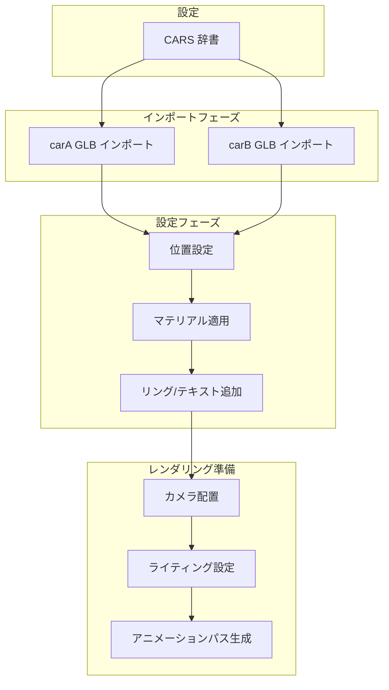

# ステップ1: 2車種GLBファイルインポートベースコード - 計画書

## タスク概要
.clinerules.txtのルールに基づき、2台の車（carA, carB）のGLBファイルをBlenderのシーンに自動でインポートし、それぞれのオブジェクトをスクリプトから操作できるように変数に格納するPythonコード（ベース部分）を作成する。

## 作成するコードの仕様

### 1. 車種データ構造
辞書型で各車の情報管理：

```python
CARS = {
    "carA": {
        "name": "Corolla Cross",
        "glb_path": r"C:\3d\Modly\glb\colloraCross2025.glb",
        "position": (-2.0, 0, 0),  # 左側に配置
        "color": (0.8, 0.2, 0.2),  # 赤色系（識別用）
    },
    "carB": {
        "name": "Target Car",
        "glb_path": r"C:\3d\Modly\glb\targetCar.glb",
        "position": (2.0, 0, 0),   # 右側に配置
        "color": (0.2, 0.2, 0.8),  # 青色系（識別用）
    },
}
```

### 2. clear_scene() 関数
- .clinerules.txt ルール3「オブジェクトのクリーンアップ」に従う
- スクリプト実行時に古いオブジェクトを完全に削除する初期化関数

### 3. import_glb_file() 関数
- .clinerules.txt ルール4「エラーハンドリング」に従う
- ファイル存在確認と例外処理を含む
- `bpy.ops.wm.gltf_import()` を使用してGLBファイルをインポート

### 4. インポートされた各車のオブジェクトを辞書として返す
```python
imported_cars = {}  # {"carA": objA, "carB": objB}
```

## 作成されるコードのプレビュー

```python
"""
ステップ1: 2台のGLBファイルをBlenderにインポートするベースコード
.clinerules.txtのルールに基づいて作成
"""

import bpy
import os

# ============================================================
# 設定変数（ここを変更して使い回し可能）
# ============================================================
CARS = {
    "carA": {
        "name": "Corolla Cross",
        "glb_path": r"C:\3d\Modly\glb\colloraCross2025.glb",
        "position": (-2.0, 0, 0),
        "color": (0.8, 0.2, 0.2),
    },
    "carB": {
        "name": "Target Car",
        "glb_path": r"C:\3d\Modly\glb\targetCar.glb",
        "position": (2.0, 0, 0),
        "color": (0.2, 0.2, 0.8),
    },
}
# ============================================================


def clear_scene():
    """シーン内のすべてのメッシュオブジェクトを削除（初期化関数）"""
    bpy.ops.object.select_all(action='DESELECT')
    
    # メッシュタイプのみを選択して削除
    mesh_objects = [obj for obj in bpy.data.objects if obj.type == 'MESH']
    for obj in mesh_objects:
        bpy.data.objects[obj.name].select_set(True)
    
    if mesh_objects:
        bpy.ops.object.delete(use_global=False)


def import_glb_file(file_path):
    """GLBファイルをBlenderにインポートし、メインオブジェクトを返す"""
    # ファイルの存在確認
    if not os.path.exists(file_path):
        print(f"エラー: ファイルが見つかりません - {file_path}")
        return None
    
    # GLBファイルをインポート
    try:
        bpy.ops.wm.gltf_import(filepath=file_path)
    except Exception as e:
        print(f"エラー: GLBインポートに失敗しました - {e}")
        return None
    
    # インポートされたオブジェクトを取得
    main_object = bpy.context.active_object
    
    if main_object is None:
        print("エラー: オブジェクトが正常にインポートされませんでした")
        return None
    
    return main_object


def setup_car(key, car_data, imported_object):
    """車の設定（位置、名前、マテリアル）を適用"""
    if imported_object is None:
        return None
    
    # 名前を変更
    imported_object.name = f"{key}_{car_data['name']}"
    imported_object.data.name = f"{key}_{car_data['name']}.Mesh"
    
    # 位置を設定
    imported_object.location = car_data['position']
    
    # シーンの原点にスケーリング調整（必要に応じて）
    bpy.context.view_layer.objects.active = imported_object
    bpy.ops.object.origin_set(type='GEOMETRY_ORIGIN', center='MEDIAN')
    
    return imported_object


# ============================================================
# メイン処理
# ============================================================
if __name__ == "__main__":
    # シーンを初期化
    clear_scene()
    
    # 各車のGLBファイルをインポート
    imported_cars = {}
    
    for key, car_data in CARS.items():
        print(f"\n--- {key} ({car_data['name']}) を読み込み中: {car_data['glb_path']} ---")
        
        if not os.path.exists(car_data['glb_path']):
            print(f"警告: ファイルが見つかりません - {car_data['glb_path']}")
            continue
        
        imported_object = import_glb_file(car_data['glb_path'])
        
        if imported_object:
            setup_car(key, car_data, imported_object)
            imported_cars[key] = imported_object
            print(f"成功: '{imported_object.name}' をインポートしました")
            print(f"  - 位置: {imported_object.location}")
        else:
            print(f"失敗: {key} のインポートに失敗しました")
    
    # 結果出力
    print("\n=== インポート結果 ===")
    for key, obj in imported_cars.items():
        print(f"{key}: {obj.name} at {obj.location}")
    
    # 変数としてアクセス可能
    carA = imported_cars.get("carA")
    carB = imported_cars.get("carB")
    
    if carA and carB:
        print("\n準備完了: 'carA' と 'carB' 変数としてオブジェクトが利用可能です")
    else:
        print("\n一部の車のインポートに失敗しました。パスを確認してください。")
```

## .clinerules.txt ルール準拠確認

| ルール | 対応状況 |
|--------|----------|
| ルール3: オブジェクトのクリーンアップ | [`clear_scene()`](plans/step1-glb-import-base-code.md) 関数を実装 |
| ルール4: エラーハンドリング | ファイル存在確認とtry-exceptブロックを追加 |
| ルール5: テンプレート構造 | `CARS` 辞書をコード先頭に定義 |

## 2車種比較動画への拡張性



## 次のステップ
この計画が承認された場合、`import bpy.py` ファイルを更新するために Code モードに切り替える。
