# ステップ2: アニメーションとマテリアル実装計画

## 📋 要件定義

### アニメーション仕様（0-120フレーム、24fps）
| 期間 | フレーム範囲 | 動作 |
|------|-------------|------|
| イントロ | 0-30 | 車が初期位置に出現 |
| 重ね合わせ | 30-90 | 中央へスライド（重なり合う） |
| キープ | 90-120 | 静止状態維持 |

### マテリアル仕様
- **車**: 単色クレイモデル（赤/青）、発光強度0.3
- **床グリッド**: ネオン発光、シアンカラー、強度5.0

## 🎯 実装詳細

### 1. アニメーション関数の追加

#### `setup_car_animation()` 関数
```python
def setup_car_animation(car_object, start_frame, end_frame, start_x, end_x):
    """車の位置アニメーションを設定"""
    # X位置のキーフレーム設定
    car_object.location = (start_x, 0.0, 0.0)
    car_object.keyframe_insert(data_path="location", frame=start_frame)
    
    car_object.location = (end_x, 0.0, 0.0)
    car_object.keyframe_insert(data_path="location", frame=end_frame)
```

#### `apply_clay_material()` 関数（修正版）
既存の `create_clay_material()` を使用し、オブジェクトに適用する関数を追加：
```python
def apply_clay_material_to_object(object_name, color_rgb):
    """指定されたオブジェクトにクレイマテリアルを適用"""
    if object_name not in bpy.data.objects:
        print(f"警告: オブジェクト '{object_name}' が見つかりません")
        return
    
    obj = bpy.data.objects[object_name]
    
    # マテリアル名（重複防止）
    mat_name = f"clay_{object_name}"
    
    if mat_name not in bpy.data.materials:
        # 新しいクレイマテリアルを作成
        material = create_clay_material(mat_name, color_rgb)
    else:
        material = bpy.data.materials[mat_name]
    
    # オブジェクトにマテリアルを適用
    if len(obj.data.materials) == 0:
        obj.data.materials.append(material)
    else:
        obj.data.materials[0] = material
    
    print(f"マテリアル適用完了: {object_name} -> {mat_name}")
```

### 2. メイン処理への統合

[`main()`](blend_scene_creator.py:339) 関数の末尾（車インポート後）に以下を追加：

```python
# =============================================
# アニメーション設定（ステップ2）
# =============================================
print("\n=== アニメーション設定を開始 ===")

# シーンフレーム範囲を設定
scene = bpy.context.scene
scene.frame_start = 0
scene.frame_end = 120
scene.render.fps = 24
print(f"フレーム範囲: {scene.frame_start}-{scene.frame_end} (fps={scene.render.fps})")

# 車のアニメーション設定（キーフレーム）
for key, car_data in CARS.items():
    # 車オブジェクト名を取得（imported_carsから）
    car_obj = imported_cars.get(key)
    if not car_obj:
        print(f"警告: {key} の車オブジェクトが見つかりません")
        continue
    
    # 0-30フレーム：初期位置に出現
    car_obj.location = (car_data['position'][0], 0.0, 0.0)
    car_obj.keyframe_insert(data_path="location", frame=0)
    car_obj.keyframe_insert(data_path="location", frame=30)
    
    # 30-90フレーム：中央へスライド
    car_obj.location = (car_data['position'][0], 0.0, 0.0)
    car_obj.keyframe_insert(data_path="location", frame=30)
    
    car_obj.location = (0.0, 0.0, 0.0)
    car_obj.keyframe_insert(data_path="location", frame=90)
    
    # 90-120フレーム：静止（キーフレームを90で固定）
    car_obj.keyframe_insert(data_path="location", frame=90)
    car_obj.keyframe_insert(data_path="location", frame=120)
    
    print(f"アニメーション設定完了: {car_obj.name}")

# マテリアルの再適用（確認用）
for key, car_data in CARS.items():
    apply_clay_material_to_object(imported_cars[key].name, car_data['color'])

print("\n=== アニメーション設定完了 ===")
```

### 3. run.py の更新（オプション）

[`run.py`](run.py) に確認オプションを追加：

```python
def main():
    parser = argparse.ArgumentParser(description="Blenderを起動して3Dシーンを作成する")
    parser.add_argument("--script", type=str, help="実行するPythonスクリプトのパス")
    parser.add_argument("--view", action="store_true", help="ビューポートを開く")
    parser.add_argument("--render", action="store_true", help="レンダーのみ実行")
    parser.add_argument("--background", action="store_true", help="バックグラウンドモードで実行（ウィンドウを閉じる）")
    parser.add_argument("--check-animation", action="store_true", help="アニメーション設定を確認して終了")
    
    args = parser.parse_args()
    
    # アニメーション確認オプション
    if args.check_animation:
        print("アニメーション設定を確認します...")
        # 簡易的な確認スクリプトを実行
        # ここでは実際の確認ロジックを記述
    
    success = run_blender(
        scene_script=args.script,
        view=args.view,
        render_only=args.render,
        background=args.background
    )
    
    sys.exit(0 if success else 1)
```

## 📊 ワークフロー図

```mermaid
gantt
    title アニメーション実装ワークフロー
    dateFormat  HH:mm
    section 準備
    コード分析           :done, des1, 09:00, 09:30
    要件定義            :done, des2, 09:30, 10:00
    
    section 実装
    アニメーション関数作成 :active, imp1, 10:00, 11:00
    マテリアル検証       :imp2, after imp1, 11:00
    run.py更新          :imp3, after imp2, 11:30
    
    section テスト
    実行テスト          :test1, after imp3, 12:00
    修正・調整          :test2, after test1, 13:00
```



## ✅ 検証チェックリスト

### アニメーション確認
- [ ] 0フレーム目で車が左右に出現
- [ ] 30-90フレーム間で滑らかに中央へ移動
- [ ] 90-120フレームで静止
- [ ] 両車は完全に重なり合う（X=0）

### マテリアル確認
- [ ] レンダービューポートで車が単色（赤/青）に表示
- [ ] 床グリッドがネオン発光している
- [ ] マテリアルプレビューモードで確認可能

### run.py 実行
- [ ] `python run.py` でシーンが作成される
- [ ] アニメーション設定が正しく適用される

## 🛠️ 修正ファイル一覧

1. **blend_scene_creator.py** - アニメーション関数追加、メイン処理更新
2. **run.py** - オプション確認機能追加（任意）

---

この計画に基づいて実装を行います。コードモードに切り替えて実施しますか？