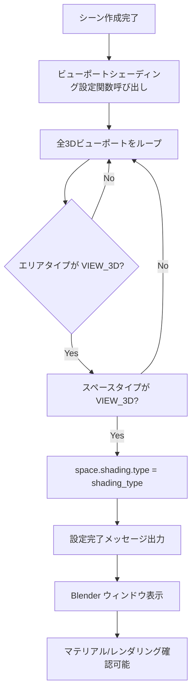

# ステップ3: ビューポートシェーディング設定機能実装計画

## 📋 要件定義

### 実装目的
スクリプト実行後、Blender ウィンドウが開いたときに自動的に **MATERIAL** または **RENDER** シェーディングモードで表示されるようにする。これにより、マテリアルやレンダリング結果を即座に確認できる。

### 実装仕様
- 3D ビューポートのシェーディングタイプを `space.shading.type` で設定
- デフォルト: `'MATERIAL'`
- サポートされるモード: `'MATERIAL'`, `'RENDER'`, `'TEXTURED'`, `'WIREFRAME'`, `'SOLID'`

## 🎯 実装詳細

### 1. 新規関数の追加

[`blend_scene_creator.py`](blend_scene_creator.py) に以下の関数を追加：

```python
def setup_viewport_shading(shading_type='MATERIAL'):
    """3Dビューポートのシェーディングモードを設定"""
    for area in bpy.context.screen.areas:
        if area.type == 'VIEW_3D':
            for space in area.spaces:
                if space.type == 'VIEW_3D':
                    # シェーディングモードを設定（MATERIAL, RENDER, TEXTURED など）
                    space.shading.type = shading_type
    print(f"ビューポートシェーディングを {shading_type} モードに設定しました")
```

**実装ポイント**:
- `bpy.context.screen.areas` をループして全エリアを取得
- `'VIEW_3D'` タイプのエリアのみ処理対象とする
- 各エリア内の `'VIEW_3D'` スペースに対してシェーディングタイプを設定
- 引数 `shading_type` でモードを指定可能（デフォルト: `'MATERIAL'`）

### 2. メイン処理への統合

[`main()`](blend_scene_creator.py:382) 関数の末尾、シーン作成完了直前にこの関数を呼び出す：

```python
# =============================================
# ビューポートシェーディング設定（ステップ3）
# =============================================
print("\n=== ビューポートシェーディングを設定 ===")
setup_viewport_shading()  # デフォルト: MATERIAL モード

print("\n" + "=" * 50)
print("シーン作成完了！")
print("=" * 50)
```

### 3. オプション拡張（将来的に）

#### `run.py` にフラグ追加

```python
def main():
    parser = argparse.ArgumentParser(description="Blenderを起動して3Dシーンを作成する")
    parser.add_argument("--script", type=str, help="実行するPythonスクリプトのパス")
    parser.add_argument("--view", action="store_true", help="ビューポートを開く")
    parser.add_argument("--render", action="store_true", help="レンダーのみ実行")
    parser.add_argument("--background", action="store_true", help="バックグラウンドモードで実行（ウィンドウを閉じる）")
    parser.add_argument("--shading-mode", type=str, choices=['MATERIAL', 'RENDER', 'TEXTURED'], 
                        default='MATERIAL', help="ビューポートシェーディングモード")
    
    args = parser.parse_args()
    
    success = run_blender(
        scene_script=args.script,
        view=args.view,
        render_only=args.render,
        background=args.background,
        shading_mode=args.shading_mode  # 渡す
    )
```

#### `run.py` の `run_blender()` 関数更新

```python
def run_blender(scene_script=None, view=False, render_only=False, background=False, shading_mode='MATERIAL'):
    """Blenderをコマンドラインから起動してスクリプトを実行する"""
    
    # ...既存コード...
    
    if render_only:
        cmd.extend(["--render-output", "//output/"])
        print("レンダーモードを有効にしました")
    
    # シェーディングモード引数を追加（将来的に）
    if shading_mode != 'MATERIAL':
        print(f"シェーディングモード: {shading_mode}")
    
    # ...コマンド実行...
```

## 📊 ワークフロー図



## ✅ 検証チェックリスト

### 基本機能
- [ ] スクリプト実行後、3D ビューポートが MATERIAL モードで開く
- [ ] 車が単色クレイマテリアルとして表示される
- [ ] 床グリッドのネオン発光が確認できる
- [ ] RENDER モードに切り替えた場合も正常に動作

### オプション拡張（実装する場合）
- [ ] `--shading-mode RENDER` で実行可能
- [ ] `--shading-mode TEXTURED` で実行可能
- [ ] 不正なモード指定時にエラーメッセージが表示される

## 🛠️ 修正ファイル一覧

1. **blend_scene_creator.py** - 関数追加、メイン処理更新
2. **run.py** - オプション拡張（任意）

## 🔄 実装ステップ

1. [`blend_scene_creator.py`](blend_scene_creator.py) に `setup_viewport_shading()` 関数を追加
2. [`main()`](blend_scene_creator.py:382) 関数に呼び出しを追加
3. テスト実行（`python run.py`）
4. Blender ウィンドウでビジュアル確認
5. （オプション）`run.py` にフラグ追加

## 📝 備考

- この機能は GUI モードでのみ有効（バックグラウンドモードではウィンドウが開かないため）
- シェーディングタイプ変更はスクリプト実行後の最終設定として行う
- 既存のシーン作成ロジックには影響を与えない

---

この計画に基づいて実装を行います。コードモードに切り替えて実施しますか？