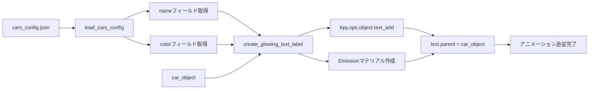

# ステップ4: 足元発光3Dテキストラベルの実装計画

## 概要

各車の足元に車種名を表示する「ネオン風発光3Dテキスト」を自動生成し、車をペアレントとしてアニメーション中に追従させる。

---

## 要件詳細

| 項目 | 仕様 |
|------|------|
| テキスト内容 | `cars_config.json` の各車の `name` フィールドから自動取得 |
| 配置位置 | 床面 Z = 0.01 付近（車の前方中央） |
| マテリアル | Emission（発光）マテリアル、車の色と同じRGBを使用 |
| ペアレント | テキストオブジェクトを車オブジェクトに親子関係設定 |
| 追従動作 | アニメーション中にテキストが車と一緒に移動 |

---

## 実装アーキテクチャ

### データフロー



### 関数追加計画

#### 1. `create_glowing_text_label(car_name, text_content, color_rgb)`

新規関数として追加。以下の処理を実行:

| ステップ | 処理内容 | Blender API |
|----------|----------|-------------|
| 1 | テキストオブジェクト生成 | `bpy.ops.object.text_add()` |
| 2 | テキスト名・位置設定 | `obj.name`, `obj.location` |
| 3 | テキストコンテンツ設定 | `obj.data.body = text_content` |
| 4 | Emissionマテリアル作成 | `ShaderNodeEmission` |
| 5 | マテリアル適用 | `obj.data.materials.append()` |

#### 2. main() への統合箇所

車の配置・アニメーション設定完了後（約890行目付近）に追加:

```python
# =============================================
# ステップ4: 3Dテキストラベル生成
# =============================================
print("\n=== 3Dテキストラベルを設定 ===")

for key, car_data in CARS.items():
    car_obj = imported_cars.get(key)
    if not car_obj:
        continue
    
    # JSONから車種名と色を取得
    text_content = car_data["name"]
    color_rgb = car_data["color"]
    
    # 発光テキストを作成（ペアレント設定含む）
    create_glowing_text_label(car_obj.name, text_content, color_rgb)

print("3Dテキストラベル設定完了")
```

---

## テキスト配置ロジック

### 座標計算

車のバウンディングボックスから前方中央の位置を算出:

| パラメータ | 値 | 理由 |
|------------|-----|------|
| X座標 | 車の中心X | 左右中央に配置 |
| Y座標 | 車のフロント端 + オフセット(0.3m) | 車体の少し前方 |
| Z座標 | 0.01 | 床面直上（浮遊感） |

### フロント端判定ロジック

```python
# バウンディングボックスからワールド座標を取得
corners_world = [car_obj.matrix_world @ Vector(corner) for corner in car_obj.bound_box]

# Y軸方向の最大値がフロント端（車の向きによる）
front_y = max(c.y for c in corners_world)
text_y = front_y + 0.3  # 車前方に配置
```

---

## Emissionマテリアル仕様

### ノード構成

| ノード | 設定値 |
|--------|--------|
| ShaderNodeEmission.Color | `(color_rgb[0], color_rgb[1], color_rgb[2], 1.0)` |
| ShaderNodeEmission.Strength | `5.0`（ネオン風発光） |

### マテリアル名規則

```python
mat_name = f"emission_label_{car_key}"
# 例: emission_label_carA, emission_label_carB
```

---

## ペアレント設定

テキストオブジェクトを車に親子関係設定:

```python
text_obj.parent = car_obj
```

これにより:
- テキストは車のローカル座標系で位置管理される
- 車のアニメーション（移動・回転）に自動追従
- キーフレーム追加不要

---

## 変更対象ファイル

| ファイル | 変更内容 |
|----------|----------|
| [`blend_scene_creator.py`](../blend_scene_creator.py) | 新規関数追加 + main() に統合 |

---

## テスト項目

1. **テキスト生成確認**: carA/carB それぞれに車種名が表示される
2. **発光確認**: Emissionマテリアルが正しく適用され、ネオン風に見える
3. **ペアレント確認**: アニメーション再生時にテキストが車に追従する
4. **JSON連携確認**: cars_config.json の name/color を変更すると反映される
