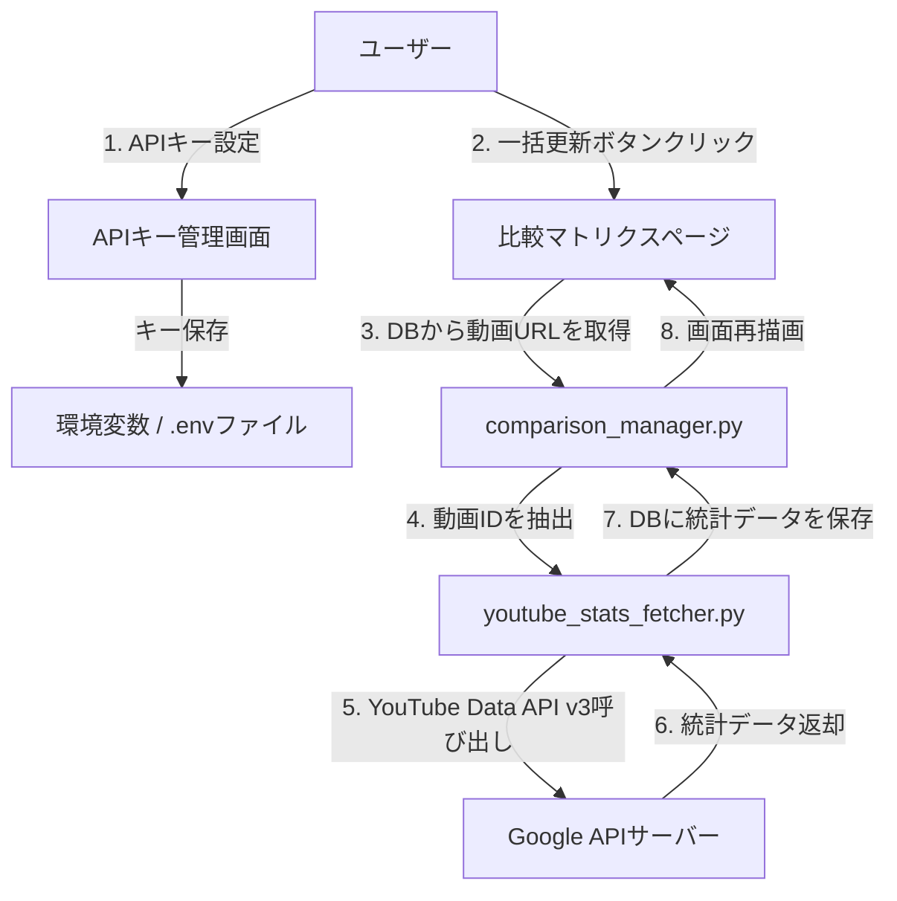

# YouTube API 視聴統計自動取得機能設計

## 1. 概要

比較マトリクスで現在手動入力している「ショート閲覧回数」「長尺閲覧回数」を、YouTube Data API v3 を使ってボタンクリックで自動取得・更新する機能を実装する。

### 目標
- YouTube動画の統計データ（視聴回数・高評価数・コメント数）をAPIで自動取得
- ボタンクリックによる手動一括更新（APIクォータ節約）
- 比較マトリクスとサイドバー編集パネルに新データを表示

## 2. YouTube Data API v3 概要

### 必要なAPI
- **YouTube Data API v3** `videos().list()` エンドポイント
- パラメータ: `part=statistics`, `id=[動画IDリスト]`

### 取得可能な統計データ
| フィールド | 説明 | APIクォータ |
|-----------|------|------------|
| `viewCount` | 視聴回数 | 1単位/動画 |
| `likeCount` | 高評価数 | 1単位/動画 |
| `commentCount` | コメント数 | 1単位/動画 |

### APIクォータ制限
- 日次上限: **10,000単位**
- 1回の `videos().list()` 呼び出しで最大50件の動画IDをバッチ処理可能
- 例: 100件の比較ペア × 2動画(ショート+長尺) = 200動画 → 4回API呼び出し = 4単位

## 3. システム構成



## 4. 実装計画

### 4.1 YouTube APIキー取得手順

1. Google Cloud Console にアクセス: https://console.cloud.google.com/
2. プロジェクトを作成（または既存プロジェクトを選択）
3. 「APIとサービス」 → 「ライブラリ」で **YouTube Data API v3** を検索して有効化
4. 「認証情報」 → 「認証情報を作成」 → 「APIキー」を選択
5. 生成されたAPIキーをコピーする

### 4.2 ファイル構成

| ファイル | 役割 | 新規/修正 |
|---------|------|----------|
| `.env` | APIキーなどの機密情報保存 | **新規** |
| `youtube_stats_fetcher.py` | YouTube API連携モジュール | **新規** |
| `comparison_manager.py` | DBスキーマ拡張 + 更新関数追加 | 修正 |
| `pages/02_比較マトリクス.py` | UI更新（ボタン・表示） | 修正 |

### 4.3 DBスキーマ拡張

`comparisons` テーブルに以下のカラムを追加：

```sql
ALTER TABLE comparisons ADD COLUMN short_likes INTEGER DEFAULT 0;
ALTER TABLE comparisons ADD COLUMN short_comments INTEGER DEFAULT 0;
ALTER TABLE comparisons ADD COLUMN long_likes INTEGER DEFAULT 0;
ALTER TABLE comparisons ADD COLUMN long_comments INTEGER DEFAULT 0;
ALTER TABLE comparisons ADD COLUMN stats_updated_at TIMESTAMP;
```

### 4.4 youtube_stats_fetcher.py モジュール設計

```python
# 主要関数一覧

def get_video_id_from_url(url: str) -> Optional[str]:
    """YouTube URLから動画IDを抽出"""
    # 対応フォーマット:
    # https://www.youtube.com/watch?v=VIDEO_ID
    # https://youtu.be/VIDEO_ID
    # https://youtube.com/shorts/VIDEO_ID

def fetch_video_stats(video_ids: List[str], api_key: str) -> Dict[str, Dict]:
    """YouTube Data API v3 で動画統計をバッチ取得"""
    # videos().list(part=statistics, id=...) を呼び出し
    # 戻り値: {video_id: {viewCount, likeCount, commentCount}}

def update_all_comparisons_stats() -> Dict[str, Any]:
    """全比較ペアの統計データを一括更新"""
    # 1. DBから short_video_url, long_video_url を全取得
    # 2. 動画IDを抽出し、バッチAPI呼び出し
    # 3. 取得した統計データをDBに保存
    # 戻り値: {success_count, error_count, errors}

def get_youtube_api_key() -> Optional[str]:
    """環境変数または.envからAPIキーを取得"""
```

### 4.5 UI変更仕様

#### 比較マトリクスセル表示（2段 → 3段表示に変更）

**現在の表示:**
```
┌──────────────┐
│ 長尺視聴回数  │
│ ショート視聴数 │
└──────────────┘
```

**変更後の表示:**
```
┌──────────────────┐
│ 👁 長尺: 12,345   │
│ 👁 ショート: 67,890│
│ 👍💬 詳細          │ ← クリックでポップオーバー
└──────────────────┘
```

ポップオーバー表示内容:
- ショート動画: 視聴回数 / 高評価数 / コメント数
- 長尺動画: 視聴回数 / 高評価数 / コメント数
- 最終更新日時

#### サイドバー編集パネル変更

**追加要素:**
1. APIキー設定セクション（初回のみ表示）
2. 「🔄 YouTube統計を一括更新」ボタン
3. 各動画の統計データ入力フィールド（手動修正用）

```
✏️ 比較ペア編集
├─ APIキー設定
│  └─ [APIキー入力欄] [保存]
├─ 🔄 YouTube統計を一括更新 [ボタン]
├─ 車A vs 車B 選択
├─ ショート動画ステータス
├─ ショート動画URL
├─ ショート統計（自動取得）
│  ├─ 視聴回数: [数値入力]
│  ├─ 高評価数: [数値入力]
│  └─ コメント数: [数値入力]
├─ 長尺動画ステータス
├─ 長尺動画URL
├─ 長尺統計（自動取得）
│  ├─ 視聴回数: [数値入力]
│  ├─ 高評価数: [数値入力]
│  └─ コメント数: [数値入力]
└─ 💾 保存 [ボタン]
```

### 4.6 エラーハンドリング

| エラー種別 | 対応策 |
|-----------|--------|
| APIキー未設定 | 「APIキーを設定してください」メッセージ表示 |
| APIキー無効 | 「APIキーが無効です。再設定してください」エラー表示 |
| クォータ超過 | 「APIクォータを超過しました。明日再試行してください」警告表示 |
| 動画ID抽出失敗 | URL形式が不正な場合はスキップ、ログ記録 |
| 動画が非公開/削除済み | その動画はスキップ、統計値を0に設定 |
| ネットワークエラー | 再試行ロジック（最大3回）、その後エラー表示 |

### 4.7 セキュリティ考慮事項

1. **APIキーの保存**: `.env` ファイルに保存し、`.gitignore` でGit管理外にする
2. **環境変数優先**: `os.environ.get("YOUTUBE_API_KEY")` → `.env` ファイル の順で読み込み
3. **ログ出力禁止**: APIキーをログやエラーメッセージに出力しない

## 5. 実装順序

1. **`.env` と `.gitignore` 更新** - 機密情報保護の基盤
2. **`youtube_stats_fetcher.py` 新規作成** - YouTube API連携コアモジュール
3. **`comparison_manager.py` 修正** - DBスキーマ拡張 + 統計更新関数追加
4. **`pages/02_比較マトリクス.py` 修正** - UI更新（APIキー設定・一括更新ボタン・表示変更）
5. **テスト** - APIキー設定 → 動画URL登録 → 一括更新 → 表示確認

## 6. 依存ライブラリ

| ライブラリ | バージョン | 用途 |
|-----------|----------|------|
| `google-api-python-client` | 最新 | YouTube Data API v3 クライアント |
| `python-dotenv` | 最新 | `.env` ファイル読み込み |

インストールコマンド:
```bash
pip install google-api-python-client python-dotenv
```

## 7. 注意事項

- **APIクォータ管理**: 1日10,000単位制限。現在43車種で最大比較ペア数は約900件だが、登録済みのペアのみ更新対象とする
- **動画URLの必須性**: YouTube統計取得には `short_video_url` / `long_video_url` が登録されている必要がある
- **非公開動画の対応**: 非公開または削除済みの動画はAPIでエラーとなるため、スキップ処理を実装
