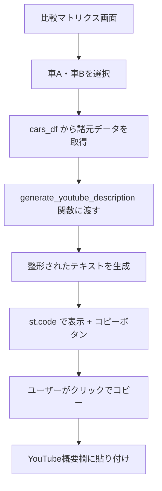

# YouTube概要欄用テキスト表示機能 - 実装計画

## 概要
比較マトリクス画面で2つの車を選択したとき、その基本諸元をYouTubeの概要欄に貼り付けられる形式でテキスト表示し、ワンクリックでコピーできるようにする。

## 対象ファイル
- `pages/02_比較マトリクス.py` (主な変更箇所)

## 実装内容

### 1. YouTube概要欄用テキスト生成関数の追加

選択された2台車の諸元データを、YouTube概要欄向けに整形した文字列を返す関数を追加する。

**関数名:** `generate_youtube_description(car_a_row, car_b_row)`

**出力フォーマット例:**
```
🚗 車A: 日産新型ムラーノ2027 vs 🚙 車B: ランドクルーザー250

【主要諸元比較】
┌──────────┬───────────┬───────────┐
│ 項目     │ ムラーノ   │ ランドクルーザー │
├──────────┼───────────┼───────────┤
│ 全長     │ 4,900mm   │ 4,925mm   │
│ 全幅     │ 1,980mm   │ 1,940mm   │
│ 全高     │ 1,725mm   │ 1,925mm   │
│ 地上高   │ 210mm     │ 230mm     │
│ 回転半径 │ 5.6m      │ 5.8m      │
│ 0-100km/h│ 10.0秒    │ 14.0秒    │
│ タイプ   │ SUV       │ SUV       │
└──────────┴───────────┴───────────┘

#車比較 #ムラーノ2027 #ランドクルーザー250 #SUV比較
```

### 2. UI追加箇所

`pages/02_比較マトリクス.py` の **諸元比較表示セクション** (約797行目〜) の直後に、以下のUIを追加する:

```
---
📝 YouTube概要欄用テキスト
[ テキストエリア (readonly) ]
[ 📋 コピーボタン ]
```

### 3. コピー機能の実装

Streamlitの `st.code` コンポーネントを使用し、その組み込みコピーボタンを活用する。
または、JavaScriptによるクリップボードコピーを実装する。

**アプローチ:** `st.code()` を使用し、言語を `text` に設定することで、右上にコピーボタンが表示される。

### 4. 実装ステップ

1. **テキスト生成関数の実装** (`pages/02_比較マトリクス.py` 上部に追加)
   - 車A・車Bの諸元データを引数に受け取る
   - 上記フォーマットで文字列を生成して返す
   - 車名は短縮名（年式除去など）を使用

2. **UIセクションの追加** (諸元比較テーブルの直後)
   - `st.subheader("📝 YouTube概要欄用テキスト")`
   - 生成したテキストを `st.code()` で表示
   - コピー成功時のフィードバック表示

3. **ハッシュタグの自動生成**
   - 車名からキーワードを抽出
   - `#車比較 #車A名 #車B名 #タイプ比較` の形式で生成

## 技術的考慮点

- 既存の諸元比較表示 (line 800-861) と同じ `car_a_row`, `car_b_row` を流用
- `st.code()` はデフォルトでコピーボタン付きなので追加実装不要
- テキストは読み取り専用とし、編集不可にする

## Mermaid ダイアグラム


