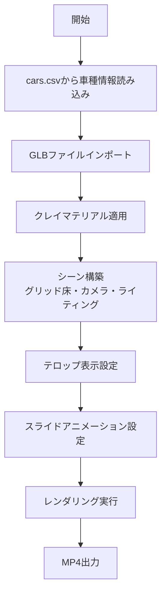

# 作業BGM動画 仕様書

## 概要
車の3Dクレイモデルを(0,0)に固定し、カメラがX軸方向にスライドして車側面を映す1分間の動画（1台分）を生成するプログラム。
ユーザーは複数台の動画を後からFinal Cut Pro等で繋いでコレクション動画を作成する想定。

short-s (`animation_settings_short_s.py`) のソースをベースに構成する。

---

## 1. 動画基本仕様

| 項目 | 仕様 |
|------|------|
| 解像度 | 1920×1080 (フルHD / 1080p) |
| アスペクト比 | 16:9 横長 |
| フレームレート | 30 FPS |
| 動画長さ | 60秒（1800フレーム、1台分） |
| 出現/消失演出 | なし（突然現れて、スライドして消える） |

---

## 2. 世界・環境設定

### 背景
- 真っ黒な背景（背景色: 黒 #000000）
- ネオン発光の3Dグリッド床面

### グリッド床
- サイズ: 1m四方のマス目、全長100m (Y=-50m ~ Y=+50m)
- 幅: X±15m
- 色: シアン色（エミッション発光、strength=6.0）
- 右端から左端へのスライド用床面として配置

### クレイモデル
- 色: **全てグレー**（RGB: 0.8, 0.8, 0.8 / テクスチャなしのクレイ調）
- 粗さ (Roughness): 0.45
- メタリック: 0.0

### クレイモデルの配置
- 車は原点(0,0)に固定配置
- 車の向き: Yマイナス方向を向く（X軸で90度回転）
- 動かない・スライドしない

---

## 3. カメラ演出

| 項目 | 仕様 |
|------|------|
| カメラ高さ | 1.7m（人の視点） |
| 移動方法 | X軸方向にスライド（X=-７m → X=+７m） |
| Y座標 | -9m固定 |
| アングル | 常にYプラス方向をまっすぐ見る（パン・チルトなし） |
| 画角 | 35mmレンズ |

### カメラ位置の詳細
- X座標: -7m → +7m（60秒かけてスライド）
- Y座標: -9m固定
- Z座標: 1.7m固定
- 向き: Yプラス方向へX軸で3°下げる（X軸回転=π/2 + 3°、少し床を見る角度）

---

## 4. テロップ表示

### 車名表示
- **位置**: 床面・車の前方（車のY座標-2m、高さZ=0.01m）
- 上を向くようX軸で90度回転
- スタイル: 薄黄色系発光文字（エミッションマテリアル）
- 色: (1.0, 0.95, 0.75, 1.0)
- 配置: 車に親設定しない（どちらも固定なので不要）
- フォント: Meiryo Bold (`mebold.ttc`)

### テロップの表示タイミング
- 動画開始から最後まで常に表示

---

## 5. ライティング

| 項目 | 仕様 |
|------|------|
| 基本照明 | 3ポイントライティング（キーライト、フィラーライト、バックライト） |
| キーライト | SUNライト、エネルギー3.0、右斜め上から照射 |
| フィラーライト | SUNライト、エネルギー1.5、左側から補助 |
| バックライト | SUNライト、エネルギー2.0、後方から輪郭光 |
| 雰囲気 | サイバーパンク風、少し暗め |
| 発光要素 | グリッド床、車名テロップ |

### short-s由来の追加照明
- 各車に追従するAREAライトを親設定（エネルギー200、サイズ3）
- 車の上部3m位置から照射

---

## 6. 車種データ管理

### データソース
- cars.csv から車種情報を1台読み込み
- 必要な情報: `id`, `name`, `glb_filename`

### 設定ファイル
- JSON形式の設定ファイルで、以下の情報を定義:
  - GLBファイルへのパス
  - 車名表示テキスト
  - スライド速度（オプション）

---

## 7. ファイル構成

```
bgm_config.py                   # 設定パラメータ（車ID、GLBパス、FPS等）
bgm_core.py                     # 核心機能（シーン構築・カメラ・アニメーション・レンダリング）
bgm_main.py                     # メインパイプライン（各ステップを順番実行）
run_bgm.py                      # Blenderランチャー
```

### 各ファイルの役割
- **bgm_config.py**: CAR_ID、GLB_DIRECTORY、FPS、DURATION_SECONDS等
- **bgm_core.py**: 車データ読み込み、スケール調整、カメラ/アニメーション/レンダリング設定
- **bgm_main.py**: シーン初期化→グリッド床→ライティング→車インポート→クレイ適用→カメラ→ラベル→アニメーション→レンダリング設定の順に実行
- **run_bgm.py**: Blender CLI経由でbgm_main.pyを起動（--renderフラグ対応）

---

## 8. アニメーションタイムライン

| フレーム | 秒数 | 内容 |
|----------|------|------|
| 0 | 0:00 | カメラがX=-7m位置から開始。車は(0,0)固定 |
| 1-1799 | 0.03s-59.96s | カメラがX軸方向にスライド（-7m → +7m） |
| 1800 | 60:00 | カメラがX=+7m位置に到達。動画終了 |

### スライド速度計算
```python
FPS = 30
TOTAL_SECONDS = 60
TOTAL_FRAMES = FPS * TOTAL_SECONDS  # 1800フレーム
SLIDE_DISTANCE = 14.0  # m (X=-7m → X=+7m)
SPEED_PER_SECOND = SLIDE_DISTANCE / TOTAL_SECONDS  # 0.233m/s
SPEED_PER_FRAME = SLIDE_DISTANCE / TOTAL_FRAMES    # 0.00778m/フレーム
```

---

## 9. レンダリング設定

| 項目 | 仕様 |
|------|------|
| エンジン | BLENDER_EEVEE（レイトレーシングON） |
| 出力形式 | MP4 (H.264) |
| 出力先 | ~/Desktop/bgm_output.mp4 |
| フレーム範囲 | 0-1800 |

---

## 10. テンプレート構造

`bgm_config.py`に変数定義を置き、以下を書き換えるだけで他の車種にも使い回せるようにする:

```python
# 車種設定
CAR_ID = "2"                          # cars.csvのID
GLB_DIRECTORY = r"C:\3d\Modly\glb"    # GLBファイル所在ディレクトリ

# 動画設定
FPS = 30
DURATION_SECONDS = 60
TOTAL_FRAMES = FPS * DURATION_SECONDS  # 1800
```

---

## 11. Mermaidダイアグラム: システムフロー



---

## 12. Mermaidダイアグラム: シーンの構成

```mermaid
graph TD
    Scene[シーン] --> World[ワールド - 黒背景]
    Scene --> Grid[グリッド床 - シアン発光]
    Scene --> Camera[カメラ - X軸スライド(-5→+5)]
    Scene --> Car[クレイモデル車 - (0,0)固定]
    Scene --> Lighting[3ポイントライティング]
    Scene --> NameTag[車名テロップ - 床面配置]
```

---

## 参照元

- short-s アニメーション: `animation_settings_short_s.py`
- ギャラリーシーン: `gallery_scene_creator.py`
- レンダリング設定: `render_animation.py`
- 車種データ: `cars.csv`
